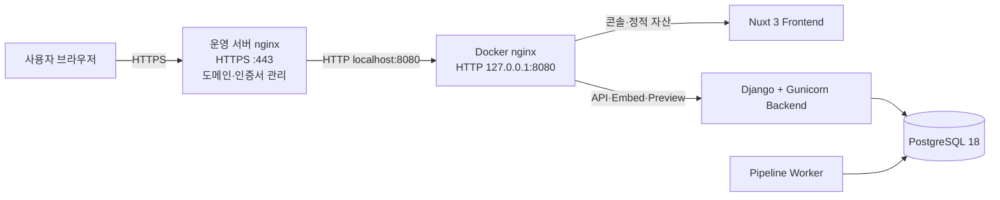

# WebMCP Auto — 운영 배포 검토 및 실행 가이드

> 대상: 기존 HTTPS nginx가 운영 중인 서버에 WebMCP Auto Docker 스택을 배포하는 구성
>
> 작성일: 2026-08-28

---

## 1. 권장 운영 아키텍처

기존 운영 서버의 nginx가 **도메인·HTTPS 인증서·TLS 종료**를 담당하고, Docker 내부 nginx로 요청을 전달하는 2단 프록시 구조를 사용한다.



### 역할 분리

| 계층 | 역할 |
|---|---|
| **운영 서버 nginx** | 실제 도메인 연결, HTTPS 인증서(Let's Encrypt 등), HTTP→HTTPS 리다이렉트, 외부 접속 제어 |
| **Docker nginx** | 컨테이너 내부 라우팅: 콘솔 요청→Nuxt, API/위젯/미리보기 요청→Django |
| **Frontend** | Nuxt 3 콘솔(랜딩, 로그인, 대시보드, 프로젝트/관리자 UI) |
| **Backend** | Django + DRF + Gunicorn, 세션 인증, API, 임베드/위젯/채팅 제공 |
| **Worker** | 크롤→LLM Q&A 생성→위젯 config 생성 파이프라인 |
| **PostgreSQL 18** | 운영 데이터 영속 저장 |

---

## 2. 현재 Docker 구성

Docker 관련 파일은 백업·관리를 쉽게 하기 위해 `docker/` 폴더에 모여 있다.

```text
webMCP_Auto/
├── docker/
│   ├── docker-compose.yml      # postgres/backend/worker/frontend/nginx
│   ├── Dockerfile.backend      # Django + Gunicorn + Terser + psycopg
│   ├── Dockerfile.frontend     # Nuxt 프로덕션 빌드
│   ├── docker-entrypoint.sh    # migrate → seed → collectstatic → gunicorn
│   ├── nginx.conf              # Docker 내부 라우팅
│   ├── backup.sh               # PostgreSQL 운영 DB 백업
│   ├── restore.sh              # PostgreSQL DB 복원
│   ├── backup-logs.sh          # 컨테이너 로그 백업
│   ├── HOWTO.md                # Docker 로컬/운영 사용 설명
│   └── .dockerignore
└── saas/
    ├── backend/
    ├── frontend/
    └── widget-dist/
```

### 컨테이너 구성

| 서비스 | 이미지/실행 | 외부 공개 | 설명 |
|---|---|---:|---|
| `postgres` | `postgres:18-alpine` | 없음 | PostgreSQL 18.6, 명명 볼륨 사용 |
| `backend` | Django + Gunicorn | 없음 | API 및 데이터 플레인 |
| `worker` | `run_pipeline_worker` | 없음 | 비동기 파이프라인 처리 |
| `frontend` | Nuxt Node 서버 | 없음 | SaaS 콘솔 |
| `nginx` | `nginx:stable-alpine` | `8080:80` | Docker 내부 reverse proxy |

---

## 3. 운영 서버 nginx 설정 방향

운영 nginx가 실제 HTTPS를 종료하고, Docker nginx는 localhost에서만 받도록 구성한다.

### 운영 nginx 예시

아래에서 `saas.example.com`을 실제 도메인으로 바꾼다.

```nginx
server {
    listen 443 ssl http2;
    server_name saas.example.com;

    ssl_certificate     /etc/letsencrypt/live/saas.example.com/fullchain.pem;
    ssl_certificate_key /etc/letsencrypt/live/saas.example.com/privkey.pem;

    client_max_body_size 10m;
    proxy_connect_timeout 30s;
    proxy_read_timeout 120s;
    proxy_send_timeout 120s;

    location / {
        proxy_pass http://127.0.0.1:8080;
        proxy_http_version 1.1;
        proxy_set_header Host $host;
        proxy_set_header X-Real-IP $remote_addr;
        proxy_set_header X-Forwarded-For $proxy_add_x_forwarded_for;
        proxy_set_header X-Forwarded-Proto https;
    }
}

server {
    listen 80;
    server_name saas.example.com;
    return 301 https://$host$request_uri;
}
```

> `/api/chat/`은 Gemini 응답에 시간이 걸릴 수 있으므로 `proxy_read_timeout`은 최소 120초를 권장한다.

---

## 4. 운영 환경변수 필수 변경

`saas/backend/.env`의 개발용 값은 운영 도메인·시크릿으로 반드시 교체한다.

| 변수 | 운영 설정 예시 | 설명 |
|---|---|---|
| `DJANGO_DEBUG` | `false` | 운영에서는 절대 true 사용 금지 |
| `DJANGO_SECRET_KEY` | 긴 랜덤 문자열 | Django 세션/암호화 보안 키 |
| `ALLOWED_HOSTS` | `saas.example.com,backend` | 실제 도메인과 컨테이너 호스트 허용 |
| `SAAS_PUBLIC_URL` | `https://saas.example.com` | 임베드 코드·위젯 endpoint의 기준 URL |
| `GEMINI_API_KEY` | 실제 비밀 키 | 실시간 채팅/요약 모델 키 |
| `OPENROUTER_API_KEY` | 실제 비밀 키 | Q&A 배치 생성 모델 키 |
| `ADMIN_SEED_EMAIL` | 관리자 이메일 | 최초 관리자 계정 |
| `ADMIN_SEED_PASSWORD` | 강력한 초기 비밀번호 | 최초 관리자 비밀번호 |
| `LOG_RETENTION_DAYS` | `28` | Django 파일 로그 보관 기간 |

### 반드시 확인할 값

`SAAS_PUBLIC_URL`은 특히 중요하다. 이 값이 잘못되면 아래 기능이 잘못된 로컬 주소를 생성한다.

- 고객 사이트 설치용 `/embed/<publicId>.js` 스니펫
- 위젯 `assetBase`
- 위젯 `proxyEndpoint`
- CSRF 신뢰 Origin

---

## 4.1 SAAS_PUBLIC_URL — 위젯 config에 박제되는 값 (가장 중요)

위젯이 생성될 때 `build_widget()`(`apps/widgets/generator.py`)은 이 값을 그대로 config에 박제한다:

```json
{
  "assetBase": "http://localhost:8080/widget-dist/",
  "proxyEndpoint": "http://localhost:8080/api/chat/"
}
```

| 값 | 역할 |
|---|---|
| `assetBase` | 고객 사이트에서 위젯 JS/CSS(`webmcp.js`·`widget.js`·`widget.css`)를 로드하는 위치 |
| `proxyEndpoint` | 위젯이 채팅 요청을 보낼 API 주소 |

> 즉, **운영에 설치하면 이 값은 운영 서버의 실제 도메인**이어야 한다.
> `localhost`/`127.0.0.1`이 남아 있으면 고객 방문자의 브라우저가 자기 자신(localhost)을 호출하게 되어 위젯이 동작하지 않는다.

### 4.1.1 운영에서 반드시 HTTPS 도메인을 써야 하는 이유

| 이유 | 설명 |
|---|---|
| **음성 입력(필수)** | `Web Speech API`는 대부분의 브라우저에서 **HTTPS 안전 컨텍스트에서만 동작**한다. HTTP에서는 마이크 접근 자체가 차단된다. |
| **Secure 쿠키** | `DEBUG=false`이면 세션/CSRF 쿠키가 `Secure`로 설정되어 HTTP에서는 전송되지 않는다. |
| **혼합 콘텐츠 차단** | 고객의 HTTPS 사이트에서 HTTP 스크립트/요청은 브라우저가 차단한다(Mixed Content). |
| **CSP** | 고객 사이트 CSP에 SaaS 도메인을 `script-src`로 추가해야 한다(HTTPS 권장). |

IP 주소로도 동작은 가능하지만 **도메인 + HTTPS를 권장**한다(위젯 기능, 인증서 관리, 향후 이전 편의성).

### 4.1.2 값을 바꾼 뒤 반드시 해야 할 작업

`SAAS_PUBLIC_URL`은 **위젯 생성(또는 재생성) 시점의 스냅샷**이다. 값만 바꾼다고 끝나지 않는다.

1. `.env`의 `SAAS_PUBLIC_URL`을 운영 도메인으로 변경
   ```dotenv
   SAAS_PUBLIC_URL=https://saas.example.com
   ```
2. `docker/docker-compose.yml`의 환경변수(backend/worker 각각)도 동기화
   ```yaml
   - SAAS_PUBLIC_URL=https://saas.example.com
   - CSRF_TRUSTED_ORIGINS=https://saas.example.com
   ```
3. 백엔드 재시작
   ```bash
   docker compose up -d backend worker
   ```
4. **기존 프로젝트 위젯 재빌드** — config에 옛 주소가 박제되어 있으므로 반드시 실행
   - 콘솔 `/admin/projects` → 각 프로젝트 **"Q&A 재생성"** (내부적으로 `build_widget` 재실행)
   - 또는 API: `POST /api/admin/projects/<id>/regenerate/`
5. 고객이 이미 배포한 **`bundle.zip` 재다운로드·재설치** 필요
   - `webmcp-config.js` 안의 `assetBase`/`proxyEndpoint`가 옛 주소이기 때문
   - **1줄 임베드**(포스터 `/embed/<publicId>.js`) 사용 고객은 재설치 불필요 — 임베드 로더가 항상 서버에서 최신 config를 받아옴
6. 검증
   ```bash
   curl https://saas.example.com/api/projects/<id>/widget/ | grep -E 'assetBase|proxyEndpoint'
   # 또는 고객 사이트에서 생성된 config 직접 확인
   ```

### 4.1.3 접속 주소 불일치와 CORS/CSRF 주의 (검증 완료 사항)

같은 서버라도 접속 주소 표기가 다르면 다른 오리진으로 취급된다(`localhost` vs `127.0.0.1`).

| 상황 | 결과 | 대응 |
|---|---|---|
| 접속 `127.0.0.1:8080`, CSRF origin에 미등록 | 로그인 403 | `CSRF_TRUSTED_ORIGINS`에 `http://127.0.0.1:8080` 포함 확인 |
| 위젯 chat/health를 절대 URL로 호출 | CORS 차단 | 이미 **상대경로**(`/api/chat/`, `/api/health/`) 사용으로 해결됨 |
| `SAAS_PUBLIC_URL`과 실제 접속 도메인 불일치 | 위젯 정적 자산 404/차단 | `assetBase`는 절대 URL이므로 운영 도메인으로 통일 |

> 로컬/운영 모두에서 위젯 통신은 상대경로 기반이므로 개발 환경에서는 origin 불일치 문제가 없다. 다만 1줄 임베드 방식은 `assetBase`가 SaaS 호스트를 가리켜야 하므로 운영 도메인 설정이 필수다.

### 4.1.4 요약

- [ ] `SAAS_PUBLIC_URL=https://운영도메인` (HTTPS 필수 권장 — 음성 입력·Secure 쿠키)
- [ ] compose의 `CSRF_TRUSTED_ORIGINS` 동기화
- [ ] 기존 프로젝트 위젯 **재빌드(재생성)** — 박제된 config 갱신
- [ ] 고객 배포본(`bundle.zip`) **재다운로드 안내** (1줄 임베드 고객은 불필요)
- [ ] `curl https://도메인/api/projects/<id>/widget/`로 최종 확인

---

## 5. Docker 포트 보안

운영 서버 nginx가 외부 HTTPS를 담당하므로 Docker nginx의 8080 포트는 인터넷에 직접 열 필요가 없다.

### 권장 compose 설정

`docker/docker-compose.yml`의 nginx 포트를 아래처럼 변경한다.

```yaml
ports:
  - "127.0.0.1:8080:80"
```

| 설정 | 결과 |
|---|---|
| `"8080:80"` | 모든 네트워크 인터페이스에서 8080 접근 가능 |
| `"127.0.0.1:8080:80"` | 운영 서버의 로컬 nginx만 Docker nginx 접근 가능 — **권장** |

---

## 6. HTTPS 프록시 시 주의사항 및 해결

외부 nginx에서 HTTPS를 종료한 후 Docker nginx로 HTTP를 전달하면, 내부 서비스는 요청을 HTTP로 오인할 수 있다.

### 문제: 원래 HTTPS 정보가 사라짐

| 영향 | 증상 |
|---|---|
| 보안 세션 쿠키 | `Secure` 쿠키가 예상대로 처리되지 않음 |
| CSRF 검사 | 실제 HTTPS Origin과 내부 HTTP Origin 불일치 |
| 절대 URL 생성 | `http://` URL이 생성될 수 있음 |
| 리다이렉트 | 잘못된 HTTP/HTTPS 리다이렉트 가능 |

### 해결

1. **외부 nginx**가 아래 헤더를 전달한다.
   ```nginx
   proxy_set_header X-Forwarded-Proto https;
   ```
2. **Docker nginx**는 이미 전달받은 `X-Forwarded-Proto` 값을 보존해야 한다.
3. **Django**는 신뢰하는 프록시에서 온 헤더만 HTTPS 판단에 사용한다.
   ```python
   SECURE_PROXY_SSL_HEADER = ('HTTP_X_FORWARDED_PROTO', 'https')
   ```
4. 실제 도메인을 `CSRF_TRUSTED_ORIGINS`에 `https://` 스킴과 함께 등록한다.

> 위 2~3단계는 운영 nginx/Docker nginx의 프록시 헤더 정책과 함께 적용해야 한다. 신뢰하지 않는 외부 요청의 `X-Forwarded-Proto`를 그대로 신뢰하면 안 된다.

---

## 7. PostgreSQL 데이터 영속성 및 백업

### 데이터 위치

PostgreSQL 데이터는 Docker 명명 볼륨에 보관된다.

```text
postgres_data → /var/lib/postgresql
```

> PostgreSQL 18+는 `/var/lib/postgresql/data`가 아니라 **`/var/lib/postgresql`** 을 마운트해야 한다.

### 가장 중요한 백업: 운영 DB 전체 덤프

```bash
cd webMCP_Auto/docker
./backup.sh
```

생성물:

```text
docker/backups/webmcp_backup_YYYYMMDD_HHMMSS/
└── postgres_dump.sql   # 사용자·프로젝트·Q&A·위젯·사용량·요청 로그 전체
```

DB만 백업하려면:

```bash
./backup.sh --db-only
```

### DB 복원

```bash
cd webMCP_Auto/docker
./restore.sh                 # 최신 백업 선택
./restore.sh --list          # 백업 목록
./restore.sh /backup/path    # 특정 백업 복원
```

직접 복원:

```bash
docker compose exec -T postgres psql -U webmcp -d webmcp < postgres_dump.sql
```

### 운영 권장

- DB 백업은 최소 **매일 1회**, 다른 서버/오브젝트 스토리지에도 별도 보관
- `docker compose down`은 볼륨을 유지하지만, `docker compose down -v`는 DB를 삭제하므로 운영에서는 주의
- PostgreSQL 주 버전 업그레이드 시 단순 이미지 태그 교체 금지: `pg_dump → 새 볼륨 → restore` 절차 사용

---

## 8. 로그 관리 및 백업

### 현재 구현된 보관 정책

| 대상 | 기록 방식 | 보관 정책 |
|---|---|---|
| Docker 컨테이너 5종 | Docker `json-file` | 파일당 10MB, 최대 28개 |
| Django 파일 로그 | `django.log` + 날짜별 로테이션 | 2000줄마다 로테이션, 28일 보관 |
| 컨테이너 로그 백업 | `backup-logs.sh` | 28일이 지난 백업 폴더 자동 삭제 |

### 로그 백업

```bash
cd webMCP_Auto/docker
./backup-logs.sh                # 전체 로그 백업 + 4주 지난 백업 정리
./backup-logs.sh --tail 500     # 최근 500줄만 백업
./backup-logs.sh --retention 28 # 보관 기간 지정
```

백업 위치:

```text
docker/backups/logs/logs_YYYYMMDD_HHMMSS/
├── webmcp-backend.log
├── webmcp-worker.log
├── webmcp-frontend.log
├── webmcp-nginx.log
└── webmcp-postgres.log
```

### 문제: 수동 실행만 하면 매일 백업되지 않음

현재 스크립트는 실행할 때만 백업한다. 운영에서는 cron 또는 systemd timer로 자동화해야 한다.

#### cron 예시 (매일 00:10 DB 백업, 00:20 로그 백업)

```cron
10 0 * * * cd /path/to/webMCP_Auto/docker && ./backup.sh --db-only >> /var/log/webmcp-db-backup.log 2>&1
20 0 * * * cd /path/to/webMCP_Auto/docker && ./backup-logs.sh --tail 5000 >> /var/log/webmcp-log-backup.log 2>&1
```

---

## 9. 배포 절차

1. 운영 서버에 프로젝트를 복사한다.
2. `saas/backend/.env`에 운영용 비밀 키·도메인·관리자 초기 비밀번호를 설정한다.
3. `docker/docker-compose.yml`에서 nginx 포트를 `127.0.0.1:8080:80`으로 제한한다.
4. 기존 운영 nginx에 실제 도메인 HTTPS 서버 블록을 추가한다.
5. Docker 스택을 시작한다.
   ```bash
   cd /path/to/webMCP_Auto/docker
   ./build.sh --run            # 빌드 + 기동 + health 체크 (한 번에)
   docker compose ps
   ```
   - `./build.sh --help` 로 빌드/기동 옵션 확인 (기본 ko+en 모두, `--ko`/`--en` 개별 지정, `--dry-run` 명령 미리보기)
6. 상태를 확인한다.
   ```bash
   curl https://saas.example.com/health/
   curl https://saas.example.com/ready/
   docker compose logs -f backend
   docker compose logs -f worker
   ```
7. 관리자 로그인 후 프로젝트 생성→파이프라인→미리보기→임베드 채팅까지 확인한다.
8. DB/로그 자동 백업 cron을 등록한다.

---

## 10. 알려진 문제점 및 해결 방법

| 문제 | 원인 | 해결 방법 |
|---|---|---|
| worker가 `relation pipeline_pipelinejob does not exist`로 종료 | backend의 migrate 완료 전에 worker가 시작 | worker를 backend readiness 이후 시작하거나 최초 배포 시 `docker compose restart worker` 실행 |
| 외부 nginx 경유 시 HTTPS가 HTTP로 인식 | TLS를 외부 nginx에서 종료 | `X-Forwarded-Proto https` 전달 + Docker nginx 보존 + Django `SECURE_PROXY_SSL_HEADER` 설정 |
| 포트 8080이 외부에 노출 | compose `"8080:80"` | `"127.0.0.1:8080:80"` 사용, 외부 nginx만 프록시 |
| 설치 코드가 `localhost:8080`으로 생성 | `SAAS_PUBLIC_URL`이 개발 값 | 실제 `https://도메인`으로 변경 후 위젯 재생성 |
| `SAAS_PUBLIC_URL` 변경 후에도 위젯이 옛 주소 사용 | config는 **생성 시점에 박제**됨 | 콘솔에서 "Q&A 재생성"으로 위젯 재빌드 + 고객 번들 재다운로드(§4.1.2) |
| 채팅은 되는데 위젯이 "연결 안 됨" 표시 | config 절대 URL과 접속 오리진 불일치(CORS) | 이미 상대경로(`/api/health/`)로 해결됨. 재발 시 위젯 재빌드 |
| 음성 입력 버튼이 동작하지 않음 | HTTP 환경(Web Speech API 제한) | `SAAS_PUBLIC_URL`을 **HTTPS** 도메인으로 설정 |
| Docker 이미지/볼륨이 프로젝트 폴더에 없음 | Docker daemon이 전용 저장소에서 관리 | 정상 동작. 중요 데이터는 `pg_dump` 기반 `backup.sh`로 백업 |
| PostgreSQL 18이 시작되지 않음 | 구 경로 `/var/lib/postgresql/data` 마운트 | PostgreSQL 18+는 `/var/lib/postgresql` 마운트 |
| `docker compose down -v` 후 데이터 소실 | 볼륨까지 제거 | 운영에서 `-v` 금지, 실행 전 `backup.sh --db-only` 수행 |
| 로그가 무한 증가 | Docker/Django 로테이션 미설정 | Docker `max-size: 10m`, `max-file: 28`; Django `LOG_RETENTION_DAYS=28` 적용 |
| `.env` 또는 백업에 시크릿 노출 | API 키·DB 비밀번호 포함 | `.env`, `docker/backups/`는 git 제외. 백업 파일 권한 제한 및 암호화/외부 보관 권장 |
| 기본 PostgreSQL 비밀번호 사용 | `webmcp_dev_pass`가 compose에 하드코딩 | 운영 전 강력한 DB 비밀번호로 변경하고 `DATABASE_URL`도 함께 변경 |
| Docker 이미지 중복 누적 | 경로 변경/재빌드 후 이전 이미지 잔존 | 정기적으로 `docker image prune` 또는 검토 후 `docker system prune` 실행 |

---

## 11. 최종 운영 체크리스트

- [ ] 실제 HTTPS 도메인 연결 및 인증서 정상
- [ ] `SAAS_PUBLIC_URL=https://실제도메인`
- [ ] **기존 프로젝트 위젯 재빌드 완료** (config에 `assetBase`/`proxyEndpoint` 박제 — §4.1)
- [ ] **고객 배포 bundle.zip 재다운로드 안내 완료** (1줄 임베드 고객 제외)
- [ ] 위젯에서 "연결됨" 배지·음성 입력(HTTPS) 동작 확인
- [ ] `DJANGO_DEBUG=false`
- [ ] `DJANGO_SECRET_KEY` 교체
- [ ] Gemini/OpenRouter 키가 `.env`에 안전하게 등록됨
- [ ] PostgreSQL 기본 비밀번호 변경
- [ ] Docker 8080이 `127.0.0.1`에만 바인딩됨
- [ ] 외부 nginx가 `X-Forwarded-Proto https` 전달
- [ ] Django 프록시 HTTPS 설정 적용
- [ ] `docker compose ps`에서 5개 서비스 정상 상태
- [ ] `/health/`, `/ready/`, 로그인, 프로젝트 생성, worker, 채팅 동작 검증
- [ ] DB 백업 및 로그 백업 cron 등록
- [ ] 백업 파일을 운영 서버 외부에도 보관

---

## 12. 다국어 사일로 (ko / en 분리 배포)

언어별로 **DB·컨테이너·LLM 엔진이 완전히 분리된 사일로**를 운영할 수 있다.
ko(한국어)와 en(영어)은 서로 다른 PostgreSQL 인스턴스·DB·컨테이너 세트에서 실행되며,
카탈로그·프로젝트·위젯 설정이 언어별로 독립된다.

### 12.1 아키텍처

| 항목 | ko 사일로 | en 사일로 |
|---|---|---|
| 접속 | `127.0.0.1:8080` | `127.0.0.1:8081` |
| 컨테이너 | webmcp-{backend,worker,frontend,nginx,postgres} | webmcp-en-{backend,worker,frontend,nginx} + webmcp-postgres-en |
| PostgreSQL DB | `webmcp_ko` | `webmcp_en` |
| 카탈로그 도메인 | 25종(병원·법률·교육·회사 등, 한국어) | 15종(hospital, law 등, 영어) |
| LLM env 접미사 | 없음 (전역 값 사용) | `_EN` 접미사 env (예: `GEMINI_API_KEY_EN`) |
| nginx conf | `nginx.conf` | `nginx-en.conf` |

### 12.2 파일 구성

```text
docker/
├── docker-compose.yml          # 기본(ko) 사일로: 127.0.0.1:8080
├── docker-compose.silo.yml     # en 사일로(추가): 127.0.0.1:8081
├── nginx.conf                  # ko 전용 (proxy_pass http://backend/frontend)
├── nginx-en.conf               # en 전용 (proxy_pass http://backend-en/frontend-en)
```

- `docker-compose.silo.yml`은 **`docker-compose.yml`과 동시 로드**할 수 없다(이름 충돌 방지 위해 별도 파일). en 사일로를 띄우려면:

```bash
cd docker
docker compose -f docker-compose.silo.yml up -d
```

- ko는 기존대로 `docker compose up -d`(기본 compose)로 띄운다.

### 12.3 필수 환경변수 (`.env`)

| env | 설명 | 예시 |
|---|---|---|
| `WEBMCP_LANG` | 사일로의 컨테이너 언어 | `ko` / `en` |
| `WEBMCP_LANGS` | 지원 언어 목록(콤마 구분) | `ko,en` |
| `GEMINI_API_KEY_EN` | en 사일로용 Gemini 키(없으면 전역 `GEMINI_API_KEY` 폴백) | AIza... |
| `GEMINI_MODEL_EN` | en 사일로용 모델(기본 `gemini-3.5-flash-lite`) | gemini-2.0-flash |
| `OPENROUTER_API_KEY_EN` | en 사일로용 OpenRouter 키 | sk-or-... |
| `OPENROUTER_MODEL_EN` | en 사일로 모델 | openai/gpt-oss-120b |
| `SAAS_PUBLIC_URL_EN` | en 사일로 공개 URL(위젯 config 박제용) | https://en.example.com |

> 언어 접미사 env가 없으면 전역 값으로 폴백한다. en 사일로 컨테이너는 `WEBMCP_LANG=en`을 가지며,
> 프로젝트 생성·Q&A 파이프라인·위젯 config 생성이 모두 en 사일로 설정을 따른다. ko DB에는 영향 없음.

> **주의**: en 사일로에 외부 도메인을 붙일 때 `SAAS_PUBLIC_URL`은 반드시 en 도메인
> (예: `https://en.example.com`)으로 설정해야 한다. 이 값은 위젯 config의
> `assetBase`/`proxyEndpoint`에 박제되므로 ko 도메인을 쓰면 위젯이 ko API를 호출하게 된다(§4.1).

### 12.4 시드 명령 (en 사일로)

en 사일로는 별도 DB이므로 최초 기동 시 migrate와 시드가 자동 실행된다(`docker-entrypoint.sh`). 수동 실행이 필요한 경우:

```bash
docker compose -f docker-compose.silo.yml exec backend-en python manage.py migrate
docker compose -f docker-compose.silo.yml exec backend-en python manage.py seed_catalogs --langs en
```

### 12.5 위젯 i18n

위젯 UI 문구는 `saas/widget-dist/webmcp-widget.js`의 `I18N` 사전(ko/en) + `t(key)` 로 결정된다.
en 위젯은 제목 기본값 "AI Assistant", 상태 "Connected", "Voice input" 등 영어 UI가 나온다.
en 위젯을 얻으려면 **en 사일로에서 프로젝트를 생성**해야 하며,
이때 프로젝트의 `lang=en`이 위젯 config에 박제되어 I18N 선택에 사용된다.

### 12.6 요약

> ko: `docker compose up -d` → `127.0.0.1:8080` (25개 한국어 도메인)
> en: `docker compose -f docker-compose.silo.yml up -d` → `127.0.0.1:8081` (15개 영어 도메인)
>
> en 사일로는 별도 PostgreSQL 인스턴스(`webmcp-postgres-en`), 별도 DB(`webmcp_en`),
> 별도 nginx conf(`nginx-en.conf`), 별도 env 접미사(`_EN`)로 **완전 격리**된다.
> 언어 사일로 모듈: `saas/backend/core/langsilo.py` (`SUPPORTED_LANGS=('ko','en')`)
