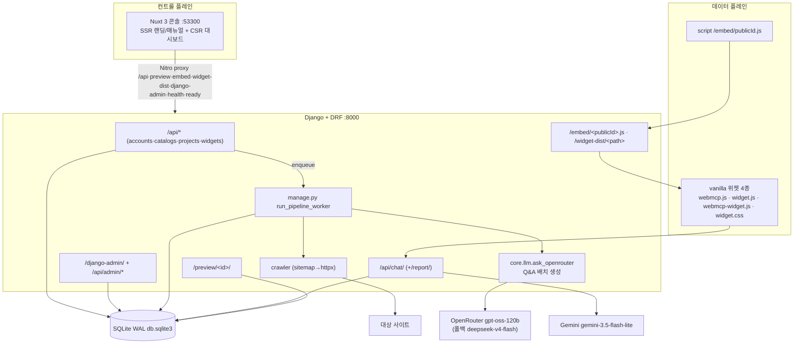
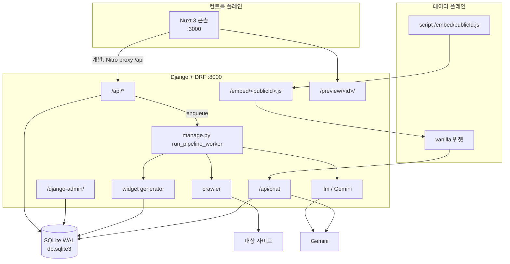
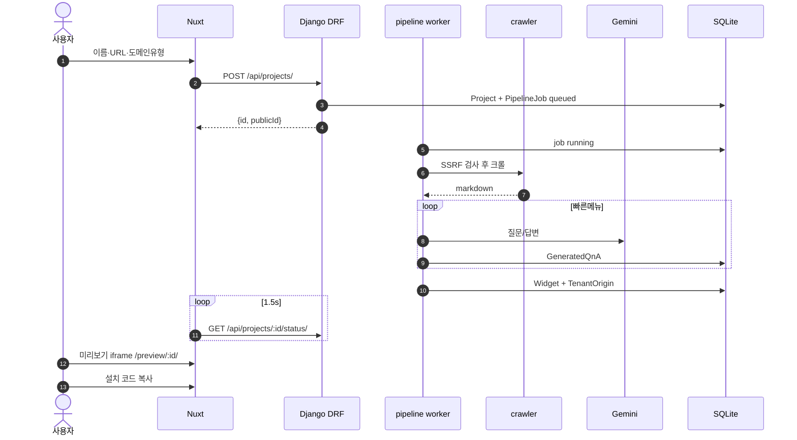

# WebMCP Auto — 완전 자동화 AI 비서 SaaS 구축 Plan

> 기존 `webmcp/` 위젯·프록시 계약을 재사용하여,
> **URL만 입력하면 크롤 → LLM Q&A → 위젯 생성 → 미리보기 → 설치**까지 자동화하는
> 멀티테넌트 SaaS를 구축한다.
>
> **확정 스택**: 콘솔 프론트 **Nuxt.js 3** · 백엔드 **Python Django + DRF** · DB **SQLite** (빠른 실현 가능성 검증).

---

## 0. 구현 완료 현황 (2026-08-30 최신)

> 검증 단계(SQLite, 단일 서버) 구현이 **전부 완료**되어 실제 E2E 동작이 확인됐다.
> 파이프라인 워커로 5개 프로젝트가 `completed`까지 진행되었고, 위젯 임베드·채팅·미리보기·설치 번들까지 동작한다.
> **2026-08-29~30: 보안 강화 → 다국어 사일로(ko/en) → 콘솔·Q&A 완전 영어화 · sitemap 수집 개선 · GitHub 퍼블리시 완료** (§0.9).
> **2026-08-30 최신: 크롤러 WAF 폴백 → 프로필/결제(엔터프라이즈 요금) → 관리자 사일로 다국어 → ko DB 복구 · 도커 사일로 정합성 개선** (§0.10).
> **2026-08-30(2): LAN 원격 접속 허용 → SECURE_COOKIES 스위치 → 갤럭시 음성입력 대응 → ALLOWED_HOSTS 자기 IP 자동 탐지** (§0.11 §0.12).

### 0.1 마일스톤 완료 현황

| 마일스톤 | 범위 | 상태 |
|---------|------|------|
| M0 스모크 | Django+Nuxt+SQLite 뼈대, Nitro 프록시, 시드 | ✅ 완료 |
| M1 계정 | 가입/로그인/비번 강제변경, 플랜 | ✅ 완료 |
| M2 관리 | 도메인유형/빠른메뉴 시드 + Django Admin | ✅ 완료 |
| M3 파이프라인 | 멀티페이지 크롤·LLM 배치 생성·워커, 재시작 복구 | ✅ 완료 |
| M4 데이터 플레인 | chat·embed·preview·Origin 화이트리스트 | ✅ 완료 |
| M5 문서 | 랜딩·매뉴얼(manual) | ✅ 완료 |
| M6 3유형 시나리오+쿼터 | 병원/법률/회사 외 **25종 도메인** + 429 쿼터 | ✅ 완료 |
| M7 (도커 운영) | **PostgreSQL 18 도커 전환 완료** — docker/ (compose·backup·restore·로그 로테이션·운영 배포 문서 DEPLOY_PORUDCTION.md) | ✅ 완료 |
| 추가(2026-08-29) | **테넌트별 Gemini 설정(테스트 후 적용)**, 프로젝트 수정 시 이름/URL 변경 금지, 프로젝트 5개 한도 안내, 이용약관 아코디언 | ✅ 완료 |
| 추가(2026-08-29) | **"AI비서란?" 필수 메뉴**(DB 공통 답변, 편집 불가), 위젯 AI 로고 아이콘, 음성 입력, 답변 생성 중 입력 잠금, 로그아웃 세션 확실 삭제, 전 페이지 noindex·robots.txt·llms.txt | ✅ 완료 |
| 추가(2026-08-29) | **보안 강화** — 브루트포스 방어(IP+이메일 5회 실패 15분 잠금), IP 화이트리스트(루프백·사설망 안전장치), 설치 가이드 Step3(설정 변경) 삭제 | ✅ 완료 |
| 추가(2026-08-29~30) | **다국어 사일로(ko/en 완전 분리)** — 언어별 DB·컨테이너·LLM 엔진·카탈로그·위젯UI·콘솔UI 분리, en 사일로 Q&A 영어 강제, sitemap 수집 개선(robots.txt 동일 호스트 우선 + HTML 폴백), **GitHub 퍼블리시** | ✅ 완료 |
| 추가(2026-08-30) | **크롤러 WAF 폴백** — 차단 감지 + Sec-Fetch 헤더 폴백 + 세션 워밍업(`_crawl_httpx` 포함). Edmunds류 강차단은 포기·대체 소스(Autolist) | ✅ 완료 |
| 추가(2026-08-30) | **프로필 페이지(일반/관리자)** — 연락처 2개, 비밀번호 변경, 결제 정보(PayPal/Stripe 연동 전), 사이트 대표 연락처 관리(SiteSetting), **엔터프라이즈 결제금액**(0=기본요금) | ✅ 완료 |
| 추가(2026-08-30) | **관리자 페이지 사일로 다국어** — /admin/projects·chat-errors에 useSilo 적용, "AI비서란?" 필수메뉴 en 분기 | ✅ 완료 |
| 추가(2026-08-30) | **도커 사일로 정합성** — nginx-ko.conf 신설, ko DB 유실 복구(임시 컨테이너 pg_dump) | ✅ 완료 |

### 0.2 실데이터 증거 (`saas/backend/db.sqlite3`)

- 사용자 2명: `admin@local`(admin/admin 플랜), `tensun@naver.com`(user/free)
- 도메인 유형 **25종** + 빠른메뉴 **100개** (유형당 4개 시드)
- 프로젝트 **5건 전부 completed**: 아인병원, 아인병원척추관절센터, 아인뷰티, 뉴로이어법률서비스, 연애의자격
- 크롤 결과(SiteContent) 5건 · 생성 Q&A 20건 · 파이프라인 잡 19건 · 위젯 버전 40개(버전관리 동작)
- 채팅 사용량(UsageEvent) 141건 · 요청 로그(RequestLog) 147건 · 다운로드 2건 · 고객센터 티켓 1건
- 크롤 결과 markdown: `saas/backend/crawled/project_<id>.md` 에 저장됨

### 0.3 모든 기능 (구현 완료)

| 영역 | 기능 | 구현 위치 |
|------|------|----------|
| 계정 | 가입(자동 로그인)·로그인(세션 로테이션)·로그아웃·비밀번호 변경(강제변경 포함) | `apps/accounts/views.py` + `login/signup.vue` |
| 계정 | CSRF 쿠키 사전 발급 (`/api/auth/csrf/`), SPA 마운트 시 발급 플러그인 | `apps/accounts` + `plugins/csrf.client.ts` |
| 계정 | 관리자 시드(`seed_admin`, `must_change_password=True`) | `management/commands/seed_admin` |
| 카탈로그 | 도메인 유형 25종(카테고리 5: 병원/법률/교육및상담/일반회사/기타) + 빠른메뉴 4개씩 시드·갱신 | `seed_catalogs` + `apps/catalogs` |
| 프로젝트 | 생성 마법사 2단계 — (1) 이름/URL + 업종·세부유형 + **테마 5종 선택** + 빠른메뉴 미리보기, (2) sitemap 상위 30개 중 **소스 페이지 최대 10개 선택** | `pages/projects/new.vue` + `POST /api/projects/` |
| 프로젝트 | 플랜 한도 검사(`max_projects`) 후 Project+TenantOrigin+PipelineJob 큐잉 | `apps/projects/views.py` |
| 프로젝트 | 상태 폴링(`status/progress/statusMessage`, 1.5초) | `pages/projects/[id].vue` |
| 프로젝트 | sitemap URL 조회(신규/수정 폼), 소스 페이지 재선택 후 **rerun(재크롤링)** | `/api/projects/sitemap-urls/`, `<pk>/sitemap-urls/`, `<pk>/rerun/` |
| 프로젝트 | **빠른메뉴 질문 편집(1회 제한 `menus_edited`) + 답변 재생성**(저장된 markdown으로, 재크롤링 없음) | `/api/projects/<pk>/menus/`, `.../menus/regenerate/` |
| 프로젝트 | **테마 변경 시 위젯 자동 재빌드** (`PATCH /api/projects/<pk>/`) | `apps/projects/views.py` + `generator.build_widget` |
| 프로젝트 | Origin 화이트리스트 추가/삭제(최소 1개 유지, 타 프로젝트 중복 금지) | `<pk>/origins/` |
| 프로젝트 | 사용중지/재개 토글(`enabled`), 삭제 | 관리자/소유자 |
| 프로젝트 | **고객센터 Q&A 게시판**(질문 2000자 제한, 10개/페이지) | `<pk>/support/` + `[id].vue` |
| 결과물 | Q&A 목록, 공개 config 조회(`system_prompt` 미포함) | `<pk>/qna/`, `<pk>/widget/` |
| 결과물 | `config.js` / `bundle.zip` 다운로드(INSTALL.md 포함, DownloadLog 기록) | `<pk>/download/...` |
| 파이프라인 | `run_pipeline_worker` 폴링 워커 — `select_for_update`, 잠금 만료 복구(`JOB_LOCK_MINUTES=15`) | `management/commands/run_pipeline_worker` |
| 파이프라인 | 크롤 — robots.txt→sitemap(index 1단계 재귀)→낮은 depth 30개, HTML `<a>` 폴백, **최대 10페이지**(페이지당 30k자), crawl4ai→httpx, JS 리다이렉트·재시도 | `apps/pipeline/crawler.py` |
| 파이프라인 | **Q&A 배치 생성**(OpenRouter 1회 호출) + 파싱 실패 메뉴만 개별 재시도 | `runner.regenerate_qna` |
| 파이프라인 | 답변 정제 — 불량 링크/HTML 태그/이메일 난독화/이모지 제거, 부정표현 금지, 병원 예약 안내 특화 | `runner._finalize_answer` |
| 파이프라인 | 크롤 결과 markdown 파일 저장(`crawled/project_<id>.md`) | `runner._save_markdown_file` |
| 파이프라인 | 위젯 생성(버전+1, `is_current` 교체, 테마/names/items, 공개 config+서버 system_prompt) | `apps/widgets/generator.py` |
| 데이터 플레인 | `/embed/<publicId>.js` 호스팅 로더 + `/widget-dist/<path>` 정적 서빙 | `apps/widgets/views.py` |
| 데이터 플레인 | `/preview/<id>/` 동일 오리진 데모 HTML(`xframe_options_exempt`) | `apps/widgets/views.py` + `pages/preview/[id].vue` |
| 데이터 플레인 | `/api/chat/` — Origin 화이트리스트 또는 세션 소유자, 쿼터, **저장된 Q&A 유사도 매칭(≥0.6)**, Gemini 실시간, Gemini 응답 형태 유지, RequestLog | `apps/proxy/views.py` |
| 데이터 플레인 | `/api/chat/report/` 오류 신고 저장(ChatErrorReport) | `apps/proxy/views.py` |
| 위젯 | 위젯 JS 4종 **신규 계약 반영** — `{question, publicId, memory}`만 전송, 기억 키 `wmcpMemory:{publicId}` | `saas/widget-dist/` |
| 위젯 | **AI 로고 런처**(테마 그라데이션 + "AI" 텍스트 + ✦), 헤더 AI 로고 박스 | `webmcp-widget.js` + `widget.css` |
| 위젯 | **음성 입력**(Web Speech API, ko-KR, 실시간 인식, 말 끝나면 자동 전송, 두 줄 "음성/입력" 버튼) | `webmcp-widget.js` + `widget.css` |
| 위젯 | **답변 생성 중 입력 잠금** — 입력창·음성·보내기·퀵메뉴 비활성화 | `webmcp-widget.js` + `widget.css` |
| 위젯 | **"AI비서란?" 필수 메뉴** — 모든 도메인에 마지막 배치, DB 공통 답변(`answer_md`), 편집/삭제 불가(`is_required`) | `seed_catalogs` + `runner._required_menu_answer` |
| 관리자 | 사용자(role/plan/active), 사용량 집계, 챗 오류 신고(new/read/resolved), 프로젝트(검색/Q&A 재생성/토글/삭제), 고객센터 답변 | `apps/proxy/admin_urls.py` + `pages/admin/*.vue` |
| 관리자 | **테넌트(프로젝트)별 Gemini 설정** — API 키/모델을 프로젝트 단위로 지정(비우면 전역 `.env` 사용), **테스트 후 적용**(실제 호출로 검증 성공 시에만 저장), OpenRouter는 전역 `.env`로만 관리 | `admin_project_llm` + `admin_project_llm_test` + `pages/admin/projects.vue` |
| 프로젝트 | **수정 시 이름/URL 변경 금지** — 도메인 유형·위젯 테마만 변경 가능(백엔드에서도 name/url 무시) | `apps/projects/views.py` + `pages/projects/[id].vue` |
| 프로젝트 | **프로젝트 생성 한도 안내(최대 5개)** — 대시보드(내 프로젝트 목록)에 표시 | `pages/dashboard.vue` |
| 프로젝트 | 하단 "읽어볼 내용" 아코디언 — **이용약관**(제1~18조) / **AI 이용고지**(AI기본법 제31조, Gemini·OpenAI OSS-120B) / **개인정보처리방침**(10조, 책임자 이장원) / **프로그램 사용동의** | `pages/projects/[id].vue` |
| 계정 | **로그아웃 세션 확실 삭제** — 순수 Django 뷰로 CSRF 우회, 세션 쿠키 명시 삭제 | `apps/accounts/views.py` + `dashboard.vue` |
| SEO | **전 페이지 noindex·nofollow**(`nuxt.config.ts`), `robots.txt` 전체 접근 금지, `llms.txt` 제공 | `nuxt.config.ts` + `public/` |
| 운영 | `/health`, `/ready`(Gemini 키), 로깅(2000줄 날짜·넘버링 로테이션), SSRF 가드, CSRF, 세션 쿠키 | `apps/widgets`, `core/` |

### 0.4 모든 스펙 (구현 기준 수치)

| 항목 | 스펙 |
|------|------|
| 스택 | Nuxt 3(`:53300`, SSR 랜딩 + CSR 대시보드) · Django 5 + DRF(`:8000`) · SQLite WAL · whitenoise |
| 프록시 | `/api` `/preview` `/embed` `/widget-dist` `/django-admin` `/health` `/ready` → Django 8000 |
| 플랜 | free: 프로젝트 5 / 월 200채팅 / 분당 10 / 동시 1 · pro: 5 / 5,000 / 60 / 2 · admin: 무제한 / 무제한 / 120 / 4 |
| 도메인 유형 | 25종(ko), 15종(en), 카테고리 5(Healthcare/Legal/Education/Company/Others), `DomainType.lang` 필터 |
| 테마 | 5종 — `blue_sky`(#0284c7) · `red_orange`(#dc2626) · `white_snow`(#334155) · `banana_pink`(#db2777) · `black_neon`(#22d3ee) |
| 크롤 | sitemap 상위 30개 탐색 → 소스 선택 최대 10개, 페이지당 30k자, 재시도 3회 |
| Q&A | 배치 생성(temperature 0.3, `max_tokens` 16384), 파싱 실패 메뉴 개별 재시도, 정제 파이프라인 적용 |
| 채팅 | `max_tokens` 1024 · timeout 30s · 저장 Q&A 유사도 ≥0.6 매칭(2초 지연) · Gemini 응답 형태 유지 |
| 위젯 계약 | body `{question, publicId, memory}`만 전송, 시스템 프롬프트는 서버 부착, 기억 `wmcpMemory:{publicId}` |
| 언어 사일로 | `WEBMCP_LANG(S)` env, `core/langsilo.py`, `NUXT_PUBLIC_SILO_LANG`(콘솔 SSR), `_EN` 접미사 LLM env, en DB `webmcp_en`(8081) |
| 인증 | Django 세션 + CSRF(`X-CSRFToken`), `SameSite=Lax`, `email` 로그인 커스텀 User |
| 파이프라인 | `JOB_LOCK_MINUTES=15`, 폴링 간격 2.0s, 잠금 만료 시 재큐/실패 |
| 게시판 | 질문 2000자 제한, 10개/페이지 |
| 소스 재선택 | 최대 10개, 빠른메뉴 질문 편집 **1회 제한**(`menus_edited`) |
| 필수 메뉴 | **"AI비서란?"** — 모든 도메인에 마지막 배치, `is_required=True`(편집/삭제 불가), DB 공통 답변(`answer_md`) |
| 위젯 아이콘 | 테마 그라데이션 원형 런처 + "AI" 텍스트 + ✦ 스파크, 헤더 AI 로고 박스 |
| 음성 입력 | Web Speech API(ko-KR), 실시간 인식, 말 끝나면 자동 전송, 두 줄 "음성/입력" 버튼 |
| 입력 잠금 | 답변 생성 중 입력창·음성·보내기·퀵메뉴 비활성화 |
| 로그아웃 | 순수 Django 뷰(CSRF 우회) + 세션 쿠키 명시 삭제 |
| SEO | 전 페이지 `noindex, nofollow`, `robots.txt` `Disallow: /`, `llms.txt` 제공 |
| 테넌트 LLM | 프로젝트별 Gemini 키/모델 지정(비우면 전역 `.env`), **테스트 후 적용**(실제 호출 검증 성공 시에만 저장), OpenRouter는 전역 전용 |
| 프로젝트 수정 | 이름/URL 변경 금지, 도메인 유형·위젯 테마만 변경 가능 |

### 0.5 사용된 LLM

| 용도 | 공급자 | 모델 | 비고 |
|------|--------|------|------|
| 위젯 실시간 채팅 | Google Gemini | `gemini-3.5-flash-lite` | `core/llm.ask` — `max_tokens=1024`, timeout 30s, 429 백오프(최대 4회), 지시문 echo 제거(`strip_instruction_echo`) |
| 사이트 요약(위젯 system_prompt용) | Google Gemini | `gemini-3.5-flash-lite` | `generator._site_summary` — **en 사일로는 영어 요약** |
| Q&A 배치 생성 · 질문 편집 재생성 | OpenRouter | `openai/gpt-oss-120b` | `core/llm.ask_openrouter` — `max_tokens=16384`, 온도 0.3, 반복 출력 감지·재시도, **en 사일로는 영어 프롬프트** |
| 폴백 모델 | OpenRouter | `deepseek/deepseek-v4-flash-latest` | 주 모델 실패 시 자동 전환 |

- 과거 `GEMINI_MODEL=gemma-4-31b-it`(개발 초기) → 현재 `gemini-3.5-flash-lite`.
- 키는 **Django `.env`에만** 존재하고 Nuxt 번들·위젯에 비노출. Nuxt는 `{question, publicId, memory}`만 중계.
- OpenRouter는 위젯 생성(배치)처럼 **긴 답변·안정성**이 필요한 작업에, Gemini는 **실시간 채팅(저지연)** 에 사용.
- **테넌트(프로젝트)별 Gemini 설정(2026-08-29)**: 관리자가 프로젝트 단위로 `gemini_api_key`/`gemini_model`을 지정할 수 있다. 비어 있으면 전역 `.env` 값을 사용한다. `core/llm._gemini_config(project)`가 테넌트 지정값을 우선 적용하며, 실시간 채팅(`proxy/views.py`), 사이트 요약(`generator._site_summary`)에 반영된다. **OpenRouter는 테넌트 설정 없이 전역 `.env`로만 관리**한다(`ask_openrouter`는 전역 전용).

### 0.6 아키텍처 구조 (구현 기준)



### 0.7 데이터베이스 설명 (구현 기준)

- 엔진: **SQLite WAL**(`PRAGMA journal_mode=WAL; foreign_keys=ON`), 파일 `saas/backend/db.sqlite3`
- `AUTH_USER_MODEL = accounts.User`(email 로그인), Django `contrib.sessions` 사용
- 앱별 테이블: `accounts_user` · `catalogs_domaintype/quickmenu` · `projects_project/tenantorigin/downloadlog/supportticket` · `pipeline_sitecontent/generatedqna/pipelinejob` · `widgets_widget` · `proxy_usageevent/requestlog/chaterrorreport` (+ Django 기본 테이블)
- **Project**: `public_id`(외부 식별자, urlsafe 12자), `origin`, `status(queued→crawling→generating→completed|failed)`, `progress`, `status_message`, `menus_edited`(질문 편집 1회 제한), `theme`, `enabled`(사용중지), `lang`(사일로 언어 ko/en)
- **DomainType**: `lang` 필드 — 같은 `code`도 언어별 별도 레코드(`UniqueConstraint(code, lang)`), 카탈로그 API는 사일로 언어로 필터
- **PipelineJob**: `selected_urls`(사용자 선택 소스), `attempt`, `locked_at`(만료 시 복구), `last_error`
- **SiteContent**: `markdown`, `char_count`, `source_urls`·`failed_urls`(JSON) — 크롤 결과
- **Widget**: `config_json`(공개) + `system_prompt`(서버 전용) + `version` + `is_current` — 버전별 이력
- **UsageEvent/RequestLog**: 쿼터 집계(kind) · 채팅 요청 verdict(ok/blocked_401/403/429) 기록
- 스키마는 **모델 + `makemigrations`** 가 진실 공급원 (init.sql은 sqlmigrate 산출물)

### 0.8 그 외 고려된 사항 (반영/결정 사항)

- **답변 품질**: 모델 지시문 echo·반복 출력 제거, 불량 링크·HTML·이메일 난독화·이모지 정제, 부정표현 금지 프롬프트, 병원은 예약 수단 우선 안내
- **비용 절감**: 저장된 Q&A 유사도(≥0.6) 매칭으로 Gemini 호출 절약, Q&A 배치 생성으로 호출 수 절약
- **보안**: SSRF 가드(`core/origins.validate_crawl_url`), Origin 화이트리스트, `public_id`만 외부 노출, 시스템 프롬프트/Gemini 키 비노출, 쿼터 429, `/api/chat/`는 `csrf_exempt`+Origin 검사
- **운영**: 2000줄 날짜·넘버링 로그 로테이션(`core/logging`), `/ready`로 Gemini 키 확인, 워커 잠금 만료 복구, 위젯 버전 관리
- **잔여 정리 대상**: `widget.js`/`webmcp-widget.js`에 레거시 `*_SYSTEM_PROMPT` 참조 코드가 일부 남아 있으나 **전송되지 않음**(동작 영향 없음). `crawl4ai`는 무거워 주석 처리, **httpx 폴백 사용 중**. M7(PostgreSQL/Celery) 미착수.
- **커밋 상태**: GitHub 퍼블리시 완료 — `https://github.com/ilyoungkim/webmcp_auto` (origin/main, 최신 커밋 ea0abb7, 2026-08-30). 기존 템플릿 파일은 강제 푸시로 제거됨.

### 0.9 다국어 사일로 + 보안 강화 (2026-08-29~30 최종)

#### 0.9.1 다국어 사일로 (ko / en 완전 분리)

언어별로 **DB·컨테이너·LLM 엔진·카탈로그·UI가 완전히 분리된 사일로**를 구현했다.

| 항목 | ko 사일로 (8080) | en 사일로 (8081) |
|------|----------------|----------------|
| DB | `webmcp_ko` (postgres-ko) | `webmcp_en` (postgres-en, 별도 PostgreSQL 인스턴스) |
| 컨테이너 | webmcp-{backend,worker,frontend,nginx,postgres} | webmcp-en-{...} + webmcp-postgres-en |
| nginx | `nginx.conf` (backend/frontend) | `nginx-en.conf` (backend-en/frontend-en) — HTTP 격리 |
| 카탈로그 | 도메인 26종(한국어, company_sales 포함) | 도메인 16개(영어) — `seed_catalogs --langs` |
| LLM env | 전역 (`GEMINI_API_KEY`) | `_EN` 접미사 (`GEMINI_API_KEY_EN` 등, 없으면 전역 폴백) |
| 위젯 UI | 한국어 (안녕하세요…, 음성/입력) | 영어 (Hello…, Voice input) — `WebMCPConfig.lang` |
| 콘솔 UI | 한국어 전면 | 영어 전면 — `NUXT_PUBLIC_SILO_LANG=en` env 주입 |

주요 구현:
- **`core/langsilo.py`** (신규) — `SUPPORTED_LANGS=('ko','en')`, `current_lang()`, `catalog_lang_tag()`, `gemini_config(lang)`, `openrouter_config(lang)`, `silo_summary()`
- **`/api/silo-info/`** (신규) — 콘솔이 사일로 언어를 확인 (`{"lang":"en"}`)
- **DomainType/Project에 `lang` 필드** — catalogs 0005, projects 0008 마이그레이션. `DomainType.code` unique → `(code, lang)` 조합 unique
- **카탈로그 시드** — `seed_catalogs --langs ko,en`, `SEED_KO`(25종) / `SEED_EN`(15종: hospital, law, company 등)
- **docker-compose.silo.yml** (신규) — en 사일로 독립 스택( 별도 DB/볼륨/8081 포트)
- **프롬프트 언어 분기** — `_batch_qna_prompt/_question_prompt/_answer_prompt`가 `project.lang`에 따라 한국어/영어 프롬프트 생성. 영어 배치 마커 `Question:/Answer:` 파싱 지원
- **영어 강제 안전장치** — `regenerate_qna`가 결과에 한글 >5% 감지 시 1회 재생성(`_has_korean`), 위젯 system_prompt·사이트 요약·병원 예약 힌트 영어화, 채팅 사용자 턴 라벨 분기(`User question:`)
- **위젯 i18n** — `I18N` 사전 + `t(key)`: 런처 aria/제목/상태/placeholder/동작방식/welcome/send/micLabel
- **콘솔 i18n** — `composables/useSilo.ts`(ko/en 사전 + `t(key, params)`), 페이지 전체(랜딩·로그인·회원가입·대시보드·New Project·상세·관리자 제외) 적용
- **정적 문서** — en 사일로용 설치 방법(`InstallGuideEn.vue`), 이용약관/AI고지/개인정보/사용동의(`TermsEn.vue`) 별도 컴포넌트

#### 0.9.2 콘솔 SSR 언어 확정

**원인**: SSR에서 `$fetch('/api/silo-info/')`가 Nuxt 내부 routeRules 프록시(`127.0.0.1:8000`)로 향해 컨테이너 안 502 → SSR 언어가 `ko`로 고정(클라이언트 하이드레이션 전 HTML이 한국어로 렌더링).

**해결**: **`NUXT_PUBLIC_SILO_LANG` 환경변수**로 SSR 언어 확정 — compose에서 en 사일로에 `=en`, ko에 `=ko` 주입. `useSilo`는 env 값을 최우선 사용하고, 없으면 `/api/silo-info/` 폴백(로컬 개발용).

- `nuxt.config.ts` `runtimeConfig.public.siloLang` 추가
- 랜딩·로그인·회원가입·대시보드·미리보기 모두 i18n 적용 후 **/ · /login · /signup · /dashboard SSR 모두 영어 확인**
- `useSilo`는 **`useState` 싱글턴** 필수 — 일반 `ref`는 컴포넌트마다 새 인스턴스가 만들어져 페이지 간 언어 공유가 안 됨

#### 0.9.3 sitemap 수집 개선

robots.txt의 sitemap 지시를 **동일 호스트 우선**으로 정렬하고 **모든 후보를 순차 시도**한다.
Hopkins Medicine처럼 robots.txt에 다른 호스트 sitemap(`profiles.xxx.org`)이 먼저 나와도 동일 호스트 sitemap까지 시도한다. 모든 sitemap 실패 시 기존 HTML `<a>` 폴백(최대 30개, 메뉴 라벨) 사용.

검증: ai-archive(robots.txt sitemap) → 상위 10개 수집, docs.python.org(9개), httpbin(HTML 폴백 2개) 성공. Hopkins는 Cloudflare 봇 차단(403)으로 서버 측 회복 불가(예외 케이스).

#### 0.9.4 보안 강화 (2026-08-29)

- **브루트포스 방어** — IP+이메일 조합 실패 카운터, **5회 실패 시 15분 잠금**(HTTP 429), 로그인 성공 시 초기화
- **IP 화이트리스트** — `User.allowed_ips`(콤마 구분) + 세션 IP 변경 감지. **안전장치**: 루프백(127.0.0.1·::1·localhost)과 사설망(10/8·172.16/12·192.168/16·Docker 게이트웨이)은 무조건 허가(락아웃 방지)
- 설치 가이드 Step 3("설정 변경"/"Customize") 삭제 — 콘솔·bundle.zip INSTALL.md 에서 모두 제거(`webmcp-config.js` 커스터마이징 유도 제거)

#### 0.9.5 GitHub 퍼블리시

- `https://github.com/ilyoungkim/webmcp_auto` — main 브랜치(커밋 5ef119f)
- 기존 Vite 템플릿 파일(index.html, package.json, src/, public/ 등)은 강제 푸시로 제거되고 현재 프로젝트로 교체됨
- 주요 커밋: `28724a3` 다국어 사일로 → `e470108` sitemap 개선 → `1ee18f7` Q&A 영어화 → `f9c06a5` 영어 강제 → `35f11d0` SSR 영어화 → `5ef119f` 스텝3 삭제

---

### 0.10 크롤 WAF 대응 + 프로필/결제 + 사일로 정합성 (2026-08-30 최신)

#### 0.10.1 크롤러 WAF 차단 대응 (커밋 e6692b1 → 83ca7ed → 4e8e319)

**원인 분석 (Autotrader 'page unavailable')**: HTTP 200 위장 차단페이지(3.7KB) 반환.
**해결 (실측 매트릭스 확정)**:
- `_looks_blocked()` — 짧은 본문(<20KB) + 차단 키워드(unavailable/denied/captcha 등)로 위장 페이지 감지
- **결정적 헤더 = Sec-Fetch-Dest/Mode/Site + Upgrade-Insecure-Requests** — Chrome UA만으론 차단, 3종+UA 조합에서 498KB 정상 응답
- **세션 워밍업** — 홈 먼저 방문(커스텀 UA 차단 시 브라우저 UA 재방문) → `_abck` 쿠키 획득 후 robots/sitemap 진행
- `_crawl_httpx()`에도 동일 폴백 적용(4e8e319) — 403/차단 감지 시 `_UA_BROWSER` 헤더로 재시도, JS 리다이렉트 추종에도 동일 헤더

**한계 (사이트별 정책)**:
- **Edmunds**: 403 명시 차단 + Googlebot/Bingbot UA도 403(지역/IP 차단) — VPN으로도 실패, **최종 포기·Autolist 대체** (같은 자동차 카테고리). robots.txt는 GPTBot/ClaudeBot 등 AI 크롤러 Disallow: /
- **Hopkins**: Cloudflare 403(시시각각 변함)
- 교훈: 대형 상업 사이트는 UA/헤더 폴백으로 안 될 수 있고, **대체 소스 사용이 실용적 해법**

#### 0.10.2 프로필 + 결제 기능 (커밋 903cdf3 → 605a733)

| 항목 | 내용 |
|------|------|
| User 모델 확장 | `phone1/phone2`, `billing_company/contact/email/address/note`, `monthly_price/currency` (accounts 0004) |
| `/profile` (일반) | 계정 정보(아이디 비활성), 비밀번호 변경, 연락처 2개, 결제 정보(PayPal/Stripe 연동 전 테스트용 입력란) |
| `/admin/profile` | 일반 프로필 + **사이트 대표 연락처** 관리 카드 |
| SiteSetting 모델 | `key/value` 단순 구조(proxy 0003) — `support_phone` 저장, `/api/admin/settings/` PATCH |
| `/api/site-info/` (공개) | 위젯 오류 문구용 대표 연락처 반환 — 02-888-9999 하드코딩 제거, `useSilo`의 `{phone}` 플레이스홀더로 치환 |
| 엔터프라이즈 요금 | admin users PATCH `monthlyPrice` — **숫자=엔터프라이즈, 빈 값 또는 0=기본 요금 복귀** (605a733) |
| 기본 요금 | 사일로별 자동: ko 50,000원/월, en $49/월 (`settings.WEBMCP_LANG` 기반, `SUPPORT_PHONE`도 .env로 기본 지정 가능) |
| 관리 UI | `/admin/projects` "💰 사용자별 결제 금액/연락처 설정" + 계정 선택 시 즉시 편집 패널 자동 표시 |

#### 0.10.3 관리자 페이지 사일로 다국어 적용 (커밋 ea0abb7)

- `/admin/projects`, `/admin/chat-errors`에 `useSilo()` 도입 — **en 사일로에서 한국어 노출 문제 해결**
- `useSilo.ts`에 `admin.*` 키 60여개 추가(ko/en 완전 대칭) — 헤더·버튼·결제패널·LLM 설정·고객센터 Q&A·confirm/메시지 전체
- `STATUS_LABELS`를 `computed`로 전환 — 프로젝트 상태(완료/진행중 등)도 언어별 표시
- `runner.py `_required_menu_answer``에 **en 분기 추가** — "AI비서란?" 필수 메뉴가 영어 고정이던 문제 해결("What is the AI assistant?")
- `prof.backToDash` 키는 이미 `← 대시보드` 화살표를 포함하므로 템플릿에 `&larr;` 중복 붙이지 않도록 수정

#### 0.10.4 도커 사일로 정합성 개선 (커밋 caf04fc)

- **`docker/nginx-ko.conf` 신설** — silo compose용 ko nginx(backend-ko/frontend-ko upstream). 기존 `nginx.conf`(backend:8000 참조)는 silo 네트워크에 없어 nginx-ko 기동 실패("host not found in upstream")였음
- `docker-compose.silo.yml`의 nginx-ko 볼륨을 `nginx-ko.conf`로 교체
- **사일로 배포 절차 확정**: `docker compose -f docker-compose.silo.yml down` → `docker/build.sh --run ko`(또는 en) → backend-ko migrate → worker-ko 재시작 → nginx-ko restart
- **구 docker-compose.yml 관계**: `LANGS_KO`는 아직 구 compose를 가리킴 — **silo compose로 교체 예정(잔여)**. 두 compose를 동시에 띄우면 8080 중복 충돌

#### 0.10.5 ko 사일로 DB 유실/복구 사건

- **원인**: 구버전 ko 컨테이너(`docker-compose.yml` 기반) 정리 시 이전 ko DB(`docker_postgres_data` 볼륨의 `webmcp` DB)가 새 사일로 DB(`webmcp_ko`)로 마이그레이션되지 않아 **tensun@naver.com 로그인 불가**
- **복구**: 임시 postgres:18-alpine 컨테이너(55432 포트)로 구 볼륨을 띄워 `pg_dump --data-only` 추출 → 신규 `webmcp_ko` DB에 복원
- **주의(학습)**: pg_dump 18.6의 `\restrict/\unrestrict` 지시어는 psql 18에서 "backslash commands are restricted"로 거부 — **sed로 해당 2줄만 정확 제거** 권장(`grep -v ^\\restrict`은 데이터 행 손상 위험). auth_permission/content_type 중복은 무해. 복원 후 `setval`로 전 시퀀스 동기화 필수
- **결과**: users 2(admin+tensun), projects 1(부천 연세본사랑병원), qna 5, widgets 6 복원 — **tensun/10dlfdud 로그인 200 확인**

#### 0.10.6 전체 기능 검토 결과 (사일로 정합성)

| 구분 | 상태 |
|---|---|
| 관리자 페이지 2곳 (projects, chat-errors) | ✅ useSilo 적용 완료 (구: 한국어 하드코딩) |
| "AI비서란?" 필수 메뉴 답변 | ✅ en 분기 추가 (구: 한국어 고정) |
| `langsilo.py` 중앙화 (엔진/카탈로그/DB 접두사) | ✅ 깔끔함 |
| `docker-compose.silo.yml` ko/en 스택 구조 | ✅ 대칭 (DB·백엔드·워커·프론트·nginx 분리) |
| `useSilo.ts` ko/en 사전 키 쌍 | ✅ 대칭 (admin.* 60여개 포함) |
| `preview_html` (widget views) 언어 분기 | ✅ ko/en 정상 |
| `projects/views.py` 프로젝트 생성 시 lang 상속 | ✅ `lang=dt.lang or cur_lang` 정상 |
| catalogs `catalog_lang_tag()` 사일로 필터 | ✅ 정상 |
| **프롬프트 상세도 비대칭 (ko > en)** | 🟡 의도된 로컬라이제이션 — en 프롬프트가 한국 연락수단(카톡/네이버 예약) 미대응. 한국 웹사이트 크롤 시 품질 저하 가능 |
| 통화 선택 드롭다운 `KRW(원)` 표기 | 🟢 통화코드 라벨이라 의도적 유지 |

#### 0.10.7 커밋 이력 (2026-08-30)

`4e8e319` 크롤 WAF 폴백 → `903cdf3` 프로필/결제 기능 → `caf04fc` 계정선택 결제 패널 + nginx-ko.conf → `605a733` 0=기본요금 → `ea0abb7` 관리자 사일로 다국어

---

### 0.11 LAN 접속 + 스마트폰 실기 검증 + 운영 배포 준비 (2026-08-30)

#### 0.11.1 LAN(192.168.x.x) 원격 접속 허용 (커밋 597b095)

- `ALLOWED_HOSTS += 192.168.31.248, 192.168.64.1` (Mac 실 LAN IP + 가상 인터페이스)
- `SAAS_PUBLIC_URL`: `http://192.168.31.248:{8080,8081}` — 위젯 config의 assetBase/proxyEndpoint **박제 주소**
- `CSRF_TRUSTED_ORIGINS`: LAN URL 추가
- 접속: 사무실 내 기기 → `http://192.168.31.248:8080`(ko) / `:8081`(en)
- **DB(5432)는 `expose` 전용** — `ports` 없음 = 호스트/LAN 어디서도 직접 접속 불가 (요구 충족)

#### 0.11.2 위젯 assetBase 박제 함정 (커밋 6eb0ee0)

- **증상**: LAN 전환 후 갤럭시에서 preview 위젯 런처 미표출
- **진짜 원인**: 기존 위젯 config에 `http://localhost:8080` 박제 — 폰에서는 localhost=폰 자신 → **위젯 JS/CSS 404**
  (데스크톱은 서버 자체라 localhost도 통했던 것)
- **수정**: DB REPLACE로 `config_json` 주소 치현 + `widget_asset()`에 `Cache-Control: no-cache, must-revalidate` (모바일 공격적 캐시 방지)
- **교훈**: `SAAS_PUBLIC_URL`이 바뀌면 **기존 프로젝트 전부 재생성/치환 필요**

#### 0.11.3 http(LAN) 로그인 쿠키 문제 (커밋 07e19df)

- **원인**: `DJANGO_DEBUG=false` → Cookie Secure 강제 → http 접속 시 브라우저가 세션/CSRF 쿠키 폐기 (스마트폰 로그인 실패)
- **수정**: `SECURE_COOKIES` env 스위치 신설(기본 `true` — https 배포 안전), compose는 개발용으로 `false` 주입
- **2026-08-30 사용자 확정**: 아직 운영기 아니므로 **false 유지**, 운영 전환 시 true로 되돌림 (확정된 미래 작업)

#### 0.11.4 갤럭시 음성입력 무반응 (커밋 0d50d3c)

- **원인**: Web Speech API(SpeechRecognition)의 마이크 권한은 **보안 콘텍스트(HTTPS/localhost) 필수** — `http://192.168.x.x`는 규격상 차단
  - MacBook localhost는 예외적으로 보안 콘텍스트라 동작했던 것
- **개선**: onerror 오류코드별 ko/en 안내 표시, 미보안 콘텍스트 클릭 즉시 HTTPS 필요 안내, 8초 무음 타임아웃
- **결론**: LAN http에서 폰 음성입력은 브라우저 규격상 불가 — **HTTPS 배포 시 자연 해결**

#### 0.11.5 위젯/미리보기 모바일 대응 (커밋 ae8e3f9)

- `widget.css`: 런처 bottom에 `calc(88px + env(safe-area-inset-bottom))` 반영, 모바일 런처 62px 확대
- `preview_html()`: `viewport-fit=cover`, 하단 여백 `calc(120px + safe-area)`, 미리보기 배지·hint 카드
- **주의**: widget.css 수정 시 `saas/widget-dist/`와 `saas/frontend/public/widget-dist/` **양쪽 동기화** 필수

#### 0.11.6 ALLOWED_HOSTS 자기 IP 자동 탐지 (커밋 bfc49c9)

**운영 서버 이관 준비** — 도메인 없이 서버 IP로 직접 접속하는 배포 지원:

- `settings.py` `_detect_host_ips()` 신설: hostname 역질 + **SIOCGIFCONF ioctl**(fcntl)로 서버 자기 IPv4 전수 탐지 (루프백 제외)
- `ALLOW_SELF_IP` env(기본 `true`)로 on/off
- **효과**: 운영 서버 이관 시 **코드 수정 없이** ifconfig로 나오는 자기 주소 전부 자동 허용 (컨테이너 내부 IP 172.x 포함). IP가 바뀌어도 재시작으로 재탐지
- **검증**: Mac(`192.168.31.248, 192.168.64.1`), ko 컨테이너(`172.21.0.6`), en 컨테이너(`172.21.0.8`) 각각 자기 IP 자동 포함 확인, ko/en 헬스 200
- **유의**: `SAAS_PUBLIC_URL`/`CSRF_TRUSTED_ORIGINS`는 위젯 박제 주소라 **여전히 수동 갱신** 필요 (도메인 연결 시)

#### 0.11.7 운영 배포 전환 체크리스트 (확정)

| 항목 | 개발(현재) | 운영 전환 시 |
|---|---|---|
| `SECURE_COOKIES` | `false` | **`true`** |
| `SAAS_PUBLIC_URL` | LAN IP | `https://도메인` (또는 공인 IP) |
| `CSRF_TRUSTED_ORIGINS` | LAN URL | `https://도메인` (+기존 유지 가능) |
| `ALLOWED_HOSTS` | 자기 IP 자동 탐지 | 자동 (도메인 추가시에만 수동) |
| 기존 프로젝트 위젯 | — | **전부 재생성** (새 주소 재박제) |

#### 0.11.8 커밋 이력 (2026-08-30 후반)

`597b095` LAN 허용 → `0eccdd0` test-results T-026 → `2eb18e9` 배포문서 §5.1 → `07e19df` SECURE_COOKIES → `ae8e3f9` 모바일 위젯 → `6eb0ee0` 위젯 no-cache → `0d50d3c` 음성입력 → `bfc49c9` 자기 IP 자동 탐지

---

## 1. 프로젝트 개요

### 1.1 목표

| # | 요구사항 | 구현 방향 |
|---|---------|----------|
| 1 | 사용자 로그인 + 관리자의 사용자 관리 | Django 세션 + 커스텀 User. Nuxt 로그인/관리 화면 |
| 2 | 로그인 후 프로젝트 생성 (이름·URL·도메인 유형) | `projects` + Nuxt 마법사. URL에서 Origin 정규화 |
| 3 | 도메인 유형별 빠른메뉴 3개 + 관리자 CRUD | `domain_types` + `quick_menus` |
| 4 | URL을 crawl4ai로 크롤 → markdown 저장 | `apps/crawler` → `site_contents` |
| 5 | LLM 질문 3개 생성·실행·저장 | `apps/pipeline` → `generated_qna` |
| 6 | 위젯 config 생성 | `apps/widgets` — 공개 WebMCPConfig |
| 7 | 생성 정보 DB 저장 | `widgets` (config_json, system_prompt, version, is_current) |
| 8 | 실제 위젯 실시간 미리보기 | Nuxt `/preview/:id`가 동일 오리진 iframe으로 Django `/preview/<id>/` 로드 |
| 9 | 설치 | **1순위** `/embed/<publicId>.js` 1줄 · **2순위** bundle.zip |
| 10 | 적용 매뉴얼 | Nuxt `/manual` |
| 11 | SaaS 웹사이트 | Nuxt 콘솔 + Django API + SQLite |
| 12 | 멀티테넌시 | 플랜·쿼터·Origin 화이트리스트·사용량 |
| 13 | 운영 가능한 파이프라인 | `pipeline_jobs` + `manage.py run_pipeline_worker` |
| 14 | 데이터 플레인 보안 | 시스템 프롬프트는 **Django가 부착**. 위젯은 `{question, publicId}`만 전송 |

### 1.2 핵심 설계 원칙

1. **콘솔과 위젯을 분리한다.** Nuxt는 SaaS 콘솔만 담당한다. 고객 사이트에 붙는 위젯은 기존 vanilla JS(`webmcp.js` 등)를 수정·재배포한다.
2. **Django를 API 서버로 쓴다.** 서버 렌더 HTML이 아니라 DRF JSON + 임베드/미리보기 특수 응답만 제공한다.
3. **SQLite로 먼저 증명한다.** 가입→프로젝트→크롤→미리보기→임베드가 한 머신에서 돌아가면 성공. PostgreSQL은 이후 `DATABASE_URL`만 바꾼다.
4. **개발 중 동일 오리진.** Nuxt 개발 서버가 `/api`, `/embed`, `/preview`를 Django로 프록시해 세션 쿠키가 깨지지 않게 한다.
5. **비밀은 Django에만.** Gemini 키·system_prompt·사이트 markdown은 Nuxt 번들에 넣지 않는다.

### 1.3 왜 Django인가 (FastAPI 대신)

| 항목 | Django로 가져가는 이유 |
|------|------------------------|
| 인증 | `django.contrib.auth` + 세션 쿠키가 SaaS 콘솔에 바로 맞음 |
| 관리자 | `/django-admin/`으로 사용자·도메인유형·Origin을 즉시 조작 → 실현 가능성 테스트 가속 |
| ORM/마이그레이션 | SQLite↔PostgreSQL 전환 시 모델은 그대로, 엔진만 교체 |
| 권한 | `IsAuthenticated` / 커스텀 `IsAdminRole` / 객체 소유권 |
| 작업 큐(초기) | Celery 없이 `pipeline_jobs` 폴링 워커로 충분. 이후 Celery만 교체 |

DRF는 얇은 JSON 레이어다. 크롤·LLM·위젯 생성 로직은 순수 Python 모듈로 두고 Django에 묶는다.

### 1.4 왜 Nuxt.js인가

| 항목 | Nuxt 3로 가져가는 이유 |
|------|------------------------|
| 콘솔 UX | 랜딩·대시보드·마법사·관리자 화면을 파일 기반 라우팅으로 빠르게 구성 |
| 인증 가드 | `middleware/auth.ts`, `middleware/admin.ts` |
| 개발 프록시 | `nuxt.config` `routeRules` / Nitro proxy로 Django와 쿠키 공유 |
| SEO 랜딩 | `/` 와 `/manual`만 SSR, 대시보드는 SPA(`ssr: false`) |
| 위젯 비포함 | 고객 임베드 스크립트는 Nuxt 빌드에 넣지 않는다 (용량·프레임워크 의존 방지) |

### 1.5 제품 모델

```
[컨트롤 플레인]  Nuxt 콘솔 → Django /api/*  (세션 쿠키)
[데이터 플레인]  고객 위젯 → Django /api/chat, /embed/<publicId>.js  (Origin + publicId)
[운영 플레인]    Django Admin + Nuxt /admin/* + pipeline worker
```

초기 Stripe는 넣지 않는다. 플랜 코드 + 월간 쿼터 + `usage_events`만 심는다.

| 플랜 | 프로젝트 수 | 월간 채팅 | 분당 호출 | 동시 파이프라인 |
|------|------------|----------|----------|----------------|
| free | 5 | 200 | 10 | 1 |
| pro | 5 | 5,000 | 60 | 2 |
| admin | 무제한 | 무제한 | 120 | 4 |

---

## 2. 기존 시스템 재사용

```
webmcp/                          # 참조
├── backend/app.py               # Gemini 호출·Rate Limit·브라우저 판별 패턴 → Django proxy 앱으로 이식
├── front/webmcp.js              # 통신 계층 — body를 {question, publicId}로 변경 후 재배포
├── front/widget.js              # 로더 — 호스팅 시 절대 URL
├── front/webmcp-widget.js       # UI — title, memory 키 publicId 스코프
├── front/widget.css
└── front/hospital-config.js     # 공개 WebMCPConfig 규격 참고
```

Streamlit `dashboard/`는 사용하지 않는다. 콘솔은 Nuxt, 운영 보조는 Django Admin.

**기존 위젯을 그대로 쓰면 깨지는 계약**

| 기존 | 문제 | 플랫폼 계약 |
|------|------|------------|
| `YONJA/HOSPITAL/GENISEV_SYSTEM_PROMPT` | SaaS siteNs에 없음 | 서버가 프롬프트 부착 |
| `P{siteNs}_SYSTEM_PROMPT` | `p12` → `Pp12_...` 오조회 | 전역 프롬프트 폐기 |
| 상대경로 `webmcp-widget.js` | 임베드 404 | `/embed`는 절대 URL |
| `wmcpMemory` 전역 | 미리보기 기억 섞임 | `wmcpMemory:{publicId}` |
| 클라이언트가 프롬프트 전문 전송 | 지식 유출 | `{question, publicId}`만 |

---

## 3. 전체 아키텍처





---

## 4. 기술 스택

| 영역 | 기술 | 비고 |
|------|------|------|
| 콘솔 프론트 | **Nuxt 3** (Vue 3, Nitro) | Node 20+. 대시보드는 CSR |
| 백엔드 | **Python 3.11+ / Django 5 / DRF** | gunicorn + whitenoise(정적) |
| DB (검증) | **SQLite** | `ENGINE=django.db.backends.sqlite3`, WAL pragma |
| DB (이후) | PostgreSQL | `DATABASE_URL`만 교체. 지금 구현하지 않음 |
| 크롤 | sitemap 기반 멀티페이지 + httpx | crawl4ai는 무거워 주석 처리(폴백). SSRF 가드 |
| LLM | **Gemini**(실시간 채팅·요약) + **OpenRouter**(Q&A 배치 생성) | 상세 §0.5. 키는 Django settings |
| 인증 | Django 세션 쿠키 | `SessionAuthentication`. JWT 없음(검증 단계) |
| 위젯 | vanilla JS 4파일 | `saas/widget-dist/` |
| 파이프라인 | `run_pipeline_worker` | Celery는 M7 이후 옵션 |
| 로컬 실행 | Nuxt `:3000` + Django `:8000` | Nitro가 Django를 프록시 |
| 배포(검증) | 한 서버: gunicorn + `nuxt generate` 또는 `node .output` | nginx가 `/`→Nuxt, `/api`→Django |

---

## 5. 디렉터리 구조

```
webMCP_Auto/
├── plan.md
├── webmcp/                          # 기존 참조
└── saas/
    ├── backend/                     # Django 프로젝트
    │   ├── manage.py
    │   ├── requirements.txt
    │   ├── .env.example
    │   ├── config/                  # 프로젝트 패키지
    │   │   ├── settings.py          # SQLite 기본
    │   │   ├── urls.py
    │   │   ├── wsgi.py
    │   │   └── asgi.py
    │   ├── apps/
    │   │   ├── accounts/            # User, 세션, 플랜, /api/auth/*
    │   │   ├── catalogs/            # DomainType, QuickMenu
    │   │   ├── projects/            # Project, TenantOrigin, DownloadLog
    │   │   ├── pipeline/            # SiteContent, GeneratedQnA, PipelineJob, worker
    │   │   ├── widgets/             # Widget, generator, embed, preview HTML
    │   │   └── proxy/               # /api/chat, request_logs, quotas
    │   ├── core/                    # origins, ssrf, llm 클라이언트
    │   └── db.sqlite3               # 런타임 생성
    ├── frontend/                    # Nuxt 3
    │   ├── nuxt.config.ts
    │   ├── package.json
    │   ├── pages/
    │   │   ├── index.vue
    │   │   ├── login.vue
    │   │   ├── signup.vue
    │   │   ├── manual.vue
    │   │   ├── dashboard.vue
    │   │   ├── projects/new.vue
    │   │   ├── projects/[id].vue
    │   │   ├── preview/[id].vue
    │   │   └── admin/{users,domains,usage}.vue
    │   ├── middleware/auth.ts
    │   ├── middleware/admin.ts
    │   ├── composables/useApi.ts
    │   └── public/                  # 콘솔 정적 자산만
    └── widget-dist/                 # 고객 위젯 원본 (Nuxt 밖)
        ├── webmcp.js
        ├── widget.js
        ├── widget.css
        └── webmcp-widget.js
```

---

## 6. DB 설계 (Django ORM + SQLite)

### 6.1 원칙

- **지금 엔진은 SQLite만.** `settings.DATABASES['default']` = `db.sqlite3`
- 커넥션 준비 시 `PRAGMA journal_mode=WAL`, `foreign_keys=ON`
- 스키마는 **모델 + `makemigrations`**. 손수 `schema.sql`을 진실 공급원으로 두지 않는다 (시드만 fixture/management command)
- 타임스탬프: `DateTimeField(auto_now_add=True)` (SQLite에 UTC로 저장)
- 프로젝트 상태: `queued → crawling → generating → completed | failed`
- job 상태: `queued → running → completed | failed`. `locked_at` 만료 시 재큐/실패
- 외부 식별자: `public_id` (urlsafe). 임베드·채팅은 정수 PK를 쓰지 않음

### 6.2 모델 (요약)

| 앱 | 모델 | 핵심 필드 |
|----|------|----------|
| accounts | User | email UK, password, name, role, plan, must_change_password, is_active |
| catalogs | DomainType | code UK, name, description, icon, **category**, sort_order, enabled |
| catalogs | QuickMenu | domain_type FK, label, question, prompt_hint, sort_order, enabled |
| projects | Project | public_id UK, user, name, url, origin, domain_type, status, progress, **status_message**, error, **menus_edited**(질문 편집 1회 제한), **theme**, **enabled**(사용중지) |
| projects | TenantOrigin | project, origin UK, enabled |
| projects | DownloadLog | project, user, file_type |
| projects | **SupportTicket** | project, user, question, answer, status(pending/answered), answered_at |
| pipeline | SiteContent | project, url, title, markdown, char_count, **source_urls**(JSON), **failed_urls**(JSON) |
| pipeline | GeneratedQnA | project, menu_label, question, answer_md, model |
| pipeline | PipelineJob | project, status, attempt, locked_at, last_error, **selected_urls**(JSON) |
| widgets | Widget | project, config_json(공개), system_prompt(서버전용), version, is_current |
| proxy | UsageEvent | user, project, kind(chat/crawl/preview/download), units |
| proxy | RequestLog | origin, public_id, ip, path, verdict(ok/blocked_401/403/429), reason |
| proxy | **ChatErrorReport** | project, public_id, origin, question, error_message, error_detail, ip, user_agent, status(new/read/resolved) |

`SupportTicket`(고객센터 게시판)과 `ChatErrorReport`(챗 오류 신고)가 추가 구현됐다. `AuditLog`는 별도 모델 없이 Django Admin 로그(`django_admin_log`)로 대체.

Django `contrib.sessions`를 쓰므로 별도 `sessions` 테이블을 만들지 않는다.

### 6.3 시드

`manage.py seed_catalogs` 가 병원/회사/법률 + 빠른메뉴 3개씩 넣는다.
`manage.py seed_admin` 가 `.env`의 `ADMIN_SEED_EMAIL` / `ADMIN_SEED_PASSWORD`로 관리자를 만든다 (`must_change_password=True`, `plan=admin`). 문서에 실제 비밀번호를 적지 않는다.

---

## 7. Django 백엔드 설계

### 7.1 앱 책임

| 앱 | 책임 |
|----|------|
| `accounts` | 가입/로그인/로그아웃/비밀번호 변경, `/api/auth/me/` |
| `catalogs` | 도메인 유형·빠른메뉴 API + Admin |
| `projects` | CRUD, Origin 추가, 다운로드, 플랜 한도 |
| `pipeline` | job enqueue, worker, 크롤/LLM 오케스트레이션 |
| `widgets` | 공개 config 생성, `/embed/<publicId>.js`, `/preview/<id>/` |
| `proxy` | `/api/chat/`, 쿼터, request_logs |
| `core` | Origin 정규화, SSRF, Gemini 클라이언트 |

### 7.2 인증

- `AUTH_USER_MODEL = 'accounts.User'` (email 로그인)
- 콘솔 API: `SessionAuthentication` + `CSRF` (`X-CSRFToken`, Nuxt가 쿠키에서 읽어 헤더로 전달)
- 로그인 성공 시 세션 로테이션
- `must_change_password=True`면 프로젝트 쓰기 차단
- `/api/chat/` 는 세션이 아니라 **Origin ∈ TenantOrigin 또는 (세션+미리보기)**

개발에서 Nuxt `:3000`이 `/api`를 Django로 프록시하므로 쿠키 `SameSite=Lax`로 충분하다.
분리 배포 시에는 `SESSION_COOKIE_SAMESITE=None; Secure` + 명시적 CORS allowlist.

### 7.3 API

#### 인증
| 메서드 | 경로 | 설명 |
|--------|------|------|
| POST | `/api/auth/signup/` | `{email, password, name}` plan=free, 자동 로그인 |
| POST | `/api/auth/login/` | 세션 + CSRF 쿠키, 세션 로테이션 |
| POST | `/api/auth/logout/` | |
| POST | `/api/auth/password/` | `{current, new}` → `must_change_password=False` |
| GET | `/api/auth/me/` | id, email, role, plan, mustChangePassword, usage |
| GET | `/api/auth/csrf/` | SPA 마운트 시 csrftoken 쿠키 사전 발급 |

#### 프로젝트
| 메서드 | 경로 | 설명 |
|--------|------|------|
| GET | `/api/domain-types/` | 유형 + 빠른메뉴 (enabled만) |
| GET/POST | `/api/projects/` | 목록 / 생성(플랜 한도 검사 후 job enqueue, `selectedUrls` 최대 10개) |
| GET/PATCH/DELETE | `/api/projects/<id>/` | 상세 / 수정(**이름·URL 변경 금지**, 도메인 유형·테마만 변경, 테마 변경 시 위젯 재빌드) / 삭제 |
| GET | `/api/projects/<id>/status/` | 폴링 (status/progress/statusMessage) |
| GET | `/api/projects/sitemap-urls/` | 신규 생성 전 sitemap 상위 30개 URL |
| GET | `/api/projects/<id>/sitemap-urls/` | 수정 폼용 sitemap URL (`?url=` 오버라이드) |
| POST | `/api/projects/<id>/rerun/` | 소스 페이지 재선택 후 재크롤링 (widget version+1) |
| GET | `/api/projects/<id>/menus/` | 빠른메뉴 + 현재 Q&A (편집용, `edited` 플래그) |
| POST | `/api/projects/<id>/menus/regenerate/` | **1회 제한**(`menus_edited`), 저장된 markdown으로 Q&A 재생성 + 위젯 재빌드 |
| POST/DELETE | `/api/projects/<id>/origins/` | Origin 화이트리스트 (최소 1개 유지, 타 프로젝트 중복 금지) |
| GET/POST | `/api/projects/<id>/support/` | 고객센터 Q&A 게시판 (10개/페이지, 질문 2000자) |

#### 결과물
| 메서드 | 경로 | 설명 |
|--------|------|------|
| GET | `/api/projects/<id>/qna/` | Q&A |
| GET | `/api/projects/<id>/widget/` | 공개 config만 (system_prompt 미포함) |
| GET | `/preview/<id>/` | 로그인+소유권, 데모 HTML (iframe src, xframe exempt) |
| GET | `/embed/<publicId>.js` | 호스팅 로더 (config 주입 + 절대 URL) |
| GET | `/widget-dist/<path>` | 위젯 정적 파일 서빙 (경로 탈출 방지) |
| GET | `/api/projects/<id>/download/config.js` | `window.WebMCPConfig = {...}` |
| GET | `/api/projects/<id>/download/bundle.zip` | 5파일 + INSTALL.md (DownloadLog 기록) |

#### 관리자 (DRF + role=admin)
| 메서드 | 경로 | 설명 |
|--------|------|------|
| GET | `/api/admin/users/` | 전체 사용자 |
| PATCH | `/api/admin/users/<id>/` `/api/admin/users/<id>/plan/` | role/plan/active 변경 |
| GET | `/api/admin/usage/` | UsageEvent kind별 집계 |
| GET/PATCH | `/api/admin/chat-errors/` `.../<id>/` | 챗 오류 신고 목록(`?status=`) / 상태 변경 |
| GET | `/api/admin/projects/` | 전체 프로젝트 (`?user_id=`) |
| POST | `/api/admin/projects/<id>/regenerate/` | 저장된 markdown으로 Q&A 재생성 + 위젯 갱신 |
| POST | `/api/admin/projects/<id>/toggle/` | 사용중지/재개 |
| GET/PATCH | `/api/admin/projects/<id>/llm/` | 테넌트(프로젝트)별 Gemini 키/모델 조회·저장(빈 값=전역 사용) |
| POST | `/api/admin/projects/<id>/llm/test/` | Gemini 키 **테스트 후 적용** — 실제 호출 검증 성공 시에만 저장 |
| DELETE | `/api/admin/projects/<id>/` | 삭제 |
| GET/POST | `/api/admin/support/` `.../<id>/answer/` | 고객센터 Q&A 목록 / 답변 등록 |

추가: Django Admin `/django-admin/` 로 검증 중 데이터 확인.

#### 데이터 플레인
| 메서드 | 경로 | 설명 |
|--------|------|------|
| POST | `/api/chat/` | `{question, publicId, memory}` → Origin/세션 인증 → 쿼터 → 저장 Q&A 매칭(≥0.6) 또는 Gemini. 401/403/429 |
| POST | `/api/chat/report/` | 위젯 '오류 신고하기' → ChatErrorReport 저장 |
| GET | `/health/` | 프로세스 |
| GET | `/ready/` | DB + `GEMINI_API_KEY` (503 가능) |

`/api/preview-chat/` 는 만들지 않는다.

### 7.4 파이프라인 워커

`python manage.py run_pipeline_worker`

1. `queued` job을 `select_for_update`로 `running` (SQLite는 짧은 트랜잭션)
2. SSRF 후 crawl4ai (실패 시 httpx). 500자 미만이면 fail
3. 빠른메뉴별 질문 생성 → 답변 생성 (실패 격리)
4. 공개 config + 서버 `system_prompt` 저장, 기본 Origin upsert, `is_current` 교체
5. `locked_at`이 `JOB_LOCK_MINUTES`를 넘은 running은 실패/재큐

Celery는 검증 단계에 넣지 않는다. 워커를 별도 터미널에서 띄운다.

### 7.5 위젯 계약 (Django가 생성)

```javascript
window.WebMCPConfig = {
  publicId: 'k7Q2...',
  siteNs: 'k7Q2',
  lang: 'ko',
  debug: false,
  title: 'OO병원 AI 비서',
  widgetVersion: 1,
  assetBase: 'https://<saas-host>/widget-dist/',
  proxyEndpoint: 'https://<saas-host>/api/chat/',
  theme: { /* 브랜드 */ },
  names: { intro: { names:['get_info'], label:'병원소개', question:'...' } },
  items: [ /* 공개 요약. 민감 연락처 제외 */ ]
};
```

전역 `*_SYSTEM_PROMPT`는 생성하지 않는다.

설치 1순위:

```html
<script src="https://<saas-host>/embed/<publicId>.js" async></script>
```

---

## 8. Nuxt 프론트엔드 설계

### 8.1 페이지

| 라우트 | 파일 | 비고 |
|--------|------|------|
| `/` | `pages/index.vue` | 랜딩 SSR |
| `/login` `/signup` | `pages/login.vue` `signup.vue` | 게스트만 |
| `/dashboard` | `pages/dashboard.vue` | auth, 프로젝트 목록·인라인 수정/삭제·비번변경 모달 |
| `/projects/new` | `pages/projects/new.vue` | 마법사 2단계 (업종·테마·소스 페이지 선택) |
| `/projects/:id` | `pages/projects/[id].vue` | 1.5초 폴링, Q&A, 설치 코드, bundle.zip, 질문 편집(1회), 고객센터 게시판, 재생성 모달 |
| `/preview/:id` | `pages/preview/[id].vue` | iframe `src=/preview/:id/` (프록시됨) |
| `/manual` | `pages/manual.vue` | SSR |
| `/admin/projects` | `pages/admin/projects.vue` | admin 미들웨어, 프로젝트 관리 + 고객센터 답변 보드 |
| `/admin/chat-errors` | `pages/admin/chat-errors.vue` | admin 미들웨어, 챗 오류 신고 관리 |

### 8.2 `nuxt.config.ts` (핵심)

```ts
export default defineNuxtConfig({
  ssr: true,
  routeRules: {
    '/dashboard/**': { ssr: false },
    '/projects/**': { ssr: false },
    '/admin/**': { ssr: false },
    '/api/**': { proxy: 'http://127.0.0.1:8000/api/**' },
    '/preview/**': { proxy: 'http://127.0.0.1:8000/preview/**' },
    '/embed/**': { proxy: 'http://127.0.0.1:8000/embed/**' },
    '/widget-dist/**': { proxy: 'http://127.0.0.1:8000/widget-dist/**' },
  },
  runtimeConfig: {
    public: { apiBase: '' } // 브라우저에서는 상대경로 → 쿠키 유지
  }
})
```

### 8.3 `useApi`

- `$fetch` + `credentials: 'include'`
- CSRF: 쿠키 `csrftoken` → 헤더 `X-CSRFToken`
- 401 → `/login`
- `mustChangePassword` → 비밀번호 변경 모달

### 8.4 미리보기

1. `/projects/:id` 완료 시 미리보기 버튼
2. `/preview/:id` 페이지가 **같은 호스트** iframe `src=/preview/:id/` 사용
3. Django가 세션·소유권을 검사하고 데모 HTML + 공개 config + 위젯 절대 경로를 반환
4. 위젯은 `/api/chat/` 호출 (프록시되어 Origin이 콘솔 호스트). 서버는 세션+소유권이면 Origin 화이트리스트를 우회

금지: `srcdoc`, `blob:`, 교차 오리진 iframe, 클라이언트에 system_prompt.

---

## 9. 매뉴얼

| 섹션 | 내용 |
|------|------|
| 1 | 우하단 AI 비서 소개 |
| 2 | 권장: `/embed/<publicId>.js` 1줄 |
| 3 | 자체 호스팅 번들 5파일 |
| 4 | Origin 자동 등록, www/스테이징은 콘솔에서 추가 |
| 5 | title/theme/names |
| 6 | 403 Origin, 429 쿼터, CSP에 SaaS 호스트 허용 |

---

## 10. 보안

- ORM 파라미터 바인딩
- XSS: 답변 escape, config JSON `<` → `\u003c`
- CSRF: 콘솔 API만. `/api/chat/`는 CSRF 면제 + Origin 검사
- SSRF: localhost/사설/메타데이터 IP 차단, 리다이렉트 재검증
- 프롬프트·Gemini 키 비노출
- `public_id`만 외부 노출
- 분당+월간 쿼터 → 429
- 가입 IP 레이트리밋
- Django `DEBUG=False` 배포, `ALLOWED_HOSTS`, `SECRET_KEY`는 env

---

## 11. 로컬에서 실현 가능성 테스트

한 머신, SQLite, 외부 의존은 Gemini 키만.

```bash
# 백엔드
cd saas/backend
python -m venv .venv && source .venv/bin/activate
pip install -r requirements.txt
cp .env.example .env          # GEMINI_API_KEY, ADMIN_SEED_*
python manage.py migrate
python manage.py seed_catalogs
python manage.py seed_admin
python manage.py runserver 127.0.0.1:8000

# 다른 터미널 — 워커
python manage.py run_pipeline_worker

# 프론트
cd saas/frontend
npm install
npm run dev                   # http://127.0.0.1:53300  → /api 프록시
```

**통과 기준 (M0 스모크)** — ✅ **2026-08-28 전부 통과** (실데이터 §0.2)

1. 시드 관리자로 로그인, 비밀번호 변경
2. 병원 유형으로 공개 URL 프로젝트 생성
3. 워커가 `completed`까지 진행 (폴링 UI)
4. 미리보기 iframe에서 퀵메뉴 1개가 `/api/chat/`로 답함
5. 설치 스니펫이 `/embed/<publicId>.js` 형태
6. Django Admin에서 Project/Widget/RequestLog가 보임

이 6개가 되면 스택은 검증된 것이다.

---

## 12. 배포 (검증 이후)

- Django: gunicorn + systemd
- Nuxt: `nuxt build` 후 `node .output/server/index.mjs` 또는 정적 generate + nginx
- nginx: `/` → Nuxt, `/api/ /embed/ /preview/ /widget-dist/ /django-admin/` → gunicorn
- `/api/chat/` `proxy_read_timeout 70s`
- SQLite 일일 `.backup` + WAL 체크포인트. 트래픽이 늘면 PostgreSQL로 엔진만 교체

`.env`: `DJANGO_SECRET_KEY`, `GEMINI_API_KEY`, `GEMINI_MODEL`, `OPENROUTER_API_KEY`, `OPENROUTER_MODEL`, `OPENROUTER_FALLBACK_MODEL`, `SAAS_PUBLIC_URL`, `ADMIN_SEED_EMAIL`, `ADMIN_SEED_PASSWORD`, `JOB_LOCK_MINUTES`

---

## 13. 마일스톤

| 단계 | 범위 | 완료 기준 | 상태 |
|------|------|----------|------|
| **M0** 스모크 | Django+Nuxt+SQLite 뼈대, 프록시, 시드 | §11 6항목 | ✅ |
| **M1** 계정 | auth, 비밀번호 강제변경, 플랜 필드 | 가입→/me | ✅ |
| **M2** 관리 | catalogs + Nuxt admin + Django Admin | 빠른메뉴 CRUD | ✅ |
| **M3** 파이프라인 | crawler/llm/worker | URL→Q&A/공개 config, 재시작 복구 | ✅ |
| **M4** 데이터 플레인 | chat, embed, preview, Origin | 미리보기 채팅 + 임베드 1줄 | ✅ |
| **M5** 문서 | 랜딩, manual | 외부 설치 가능 | ✅ |
| **M6** 3유형 시나리오 | 병원/회사/법률 + 쿼터 429 | 25종 도메인 + 429 동작 | ✅ |
| **M7** (나중) | PostgreSQL, 선택 Celery | 엔진 교체만으로 동작 | ⏳ 미착수 |

---

## 14. 리스크

| 리스크 | 대응 |
|--------|------|
| crawl4ai/playwright 무거움 | httpx 폴백으로 M0는 통과 |
| SQLite 쓰기 잠금 | WAL + 워커 1프로세스 + 짧은 트랜잭션 |
| Nuxt/Django 포트 분리 → 쿠키 깨짐 | 개발·운영 모두 `/api`를 동일 호스트로 프록시 |
| CSRF + SPA | Nuxt가 `csrftoken`을 헤더로 전달 |
| iframe 미리보기 403 | 동일 오리진 `/preview/`, preview-chat 없음 |
| 위젯 프롬프트 오조회 | 서버 부착, 전역 변수 폐기 |
| 워커 미기동 | `/ready/`와 프로젝트 status에 worker heartbeat 표시 |
| Gemini 비용 | 플랜 쿼터 + 저장된 Q&A 우선 매칭(선택) |

---

## 15. 요구사항 ↔ 구현

| 요구 | 담당 |
|------|------|
| 1 로그인·사용자 | `apps/accounts`, Nuxt login, Django Admin |
| 2 프로젝트 생성 | `apps/projects`, `pages/projects/new.vue` |
| 3 빠른메뉴 | `apps/catalogs` |
| 4 크롤 | `apps/pipeline` + `core` SSRF |
| 5 LLM Q&A | worker + Gemini |
| 6–7 config/DB | `apps/widgets` |
| 8 미리보기 | Django `/preview/` + Nuxt iframe |
| 9 설치 | `/embed/<publicId>.js` + zip |
| 10 매뉴얼 | `pages/manual.vue` |
| 11 SaaS | Nuxt + Django + **SQLite** |
| 12 멀티테넌시 | plan, TenantOrigin, UsageEvent |
| 13 파이프라인 | `run_pipeline_worker` |
| 14 보안 | 서버 프롬프트 부착, `/api/chat/` |

---

## 16. 사용 방법 (로컬 실행)

> 콘솔 접속 주소는 `SAAS_PUBLIC_URL`(개발 기준 `http://127.0.0.1:53300`) 기준.
> 백엔드 API는 같은 호스트의 `/api`, `/preview`, `/embed`로 프록시되어 쿠키가 유지된다.

### 16.1 사전 조건 (터미널 3개)

```bash
# 1) 백엔드 API
cd saas/backend
source .venv/bin/activate
python manage.py runserver 127.0.0.1:8000

# 2) 파이프라인 워커 (크롤→LLM→위젯 생성. 없으면 프로젝트가 completed 되지 않음)
python manage.py run_pipeline_worker

# 3) 프론트엔드 콘솔
cd saas/frontend
npm run dev          # http://127.0.0.1:53300
```

시드(최초 1회): `python manage.py seed_catalogs` · `python manage.py seed_admin`
상태 확인: `GET http://127.0.0.1:8000/health/` → `{"status":"ok"}`

### 16.2 테스트 사용자(일반 회원) 로그인

1. 브라우저에서 `http://127.0.0.1:53300/signup` 접속
2. 이메일 · 이름 · 비밀번호(8자 이상) 입력 후 **가입**
3. 가입 즉시 세션 쿠키 발급 → `/dashboard` 이동 (플랜 `free`)
4. 이후 `/login`에서 같은 이메일·비밀번호로 로그인

- API 직접 가입: `POST /api/auth/signup/` `{ "email": "...", "name": "...", "password": "........" }` → 201
- API 로그인: `POST /api/auth/login/` `{ "email": "...", "password": "..." }` (로그인 시 `csrftoken` 쿠키 발급)

### 16.3 관리자(admin) 로그인

관리자 계정은 `.env`의 `ADMIN_SEED_EMAIL` / `ADMIN_SEED_PASSWORD`로 시드된다(기본 이메일 `admin@local`, 비밀번호 `admin!1234`).

1. `.env`에 `ADMIN_SEED_PASSWORD`를 채운다 (비어 있으면 `seed_admin`이 거부)
2. `python manage.py seed_admin` 실행 → `admin@local` 계정 생성/갱신 (`role=admin`, `plan=admin`, 슈퍼유저)
3. 콘솔 로그인: `http://127.0.0.1:53300/login` → 관리자 이메일 + 비밀번호
4. **최초 로그인은 `must_change_password=True`** 이므로 비밀번호 변경이 강제된다(콘솔에서 변경 모달)
5. Django Admin: `http://127.0.0.1:8000/django-admin/` → 동일 계정(슈퍼유저)으로 로그인.
   `Project` / `Widget` / `RequestLog` / `User` / `DomainType` / `QuickMenu`를 GUI에서 확인·수정 가능

> 관리자 `admin@local` 비밀번호는 `admin!1234`, 첫 로그인 시 변경 강제됩니다.
>
> ⚠️ **보안 공지**: 위 비밀번호는 로컬 개발용 임시값입니다. 운영/배포 전 반드시 변경하세요 — `.env`의 `ADMIN_SEED_PASSWORD`를 수정하고 `python manage.py seed_admin`을 재실행하거나, Django Admin(`/django-admin/`)에서 사용자 비밀번호를 변경하세요.

### 16.4 프로그램 사용 step by step

| 단계 | 화면 / 동작 | 비고 |
|------|------------|------|
| 1 | `/signup` 또는 `/login`으로 진입 | 세션 발급 |
| 2 | `/dashboard` → **+ 새 프로젝트** | |
| 3 | `/projects/new` → 프로젝트명 · 대상 URL · 도메인 유형(병원/회사/법률) 선택 → **생성** | 생성 시 플랜 한도 검사 후 `PipelineJob` 큐잉 |
| 4 | `/projects/:id` 자동 폴링(1.5초) | 상태: `queued → crawling → generating → completed` (실패 시 `failed`) |
| 5 | 워커가 크롤→LLM Q&A→위젯 생성 완료 | `completed`가 되면 아래 항목 노출 |
| 6 | **설치 코드** 복사 (`/embed/<publicId>.js` 1줄 스니펫) | 고객 사이트 `<head>`/`<body>` 하단 삽입 |
| 7 | **Q&A** 목록 확인 (도메인 유형별 빠른메뉴 질문/답변) | |
| 8 | **미리보기 열기** → `/preview/:id` | 동일 오리진 iframe이 Django `/preview/:id/`를 로드, 위젯 채팅 동작 확인 |
| 9 | (선택) `bundle.zip` 다운로드 → 자체 호스팅 | 5파일 수동 배포 시 |
| 10 | (관리자) `/django-admin/` 또는 콘솔 `/admin/*`에서 사용자·도메인유형·Origin·사용량 관리 | |

**고객 사이트 적용 예시**

```html
<!-- 고객 사이트 하단 -->
<script src="http://127.0.0.1:53300/embed/<publicId>.js" async></script>
```

- 운영 시 `src` 호스트는 `SAAS_PUBLIC_URL`(예: `https://your-saas.com`)로 교체
- 위젯은 `{question, publicId}`만 전송하고, 시스템 프롬프트는 Django가 부착(§1.2 원칙 5)
- Origin 화이트리스트: 프로젝트 생성 시 대상 Origin이 자동 등록되며, www/스테이징은 콘솔에서 추가(§7.3 `origins/`)

### 16.5 Docker로 실행 (ko / en 사일로)

```bash
cd docker

# 한국어 사일로 — http://localhost:8080
docker compose up -d --build

# 영어 사일로 (별도 DB·컨테이너) — http://localhost:8081
docker compose -f docker-compose.silo.yml up -d --build
```

- en 사일로 최초 기동 시 `docker-entrypoint.sh`가 migrate·시드를 자동 실행
- 수동 실행: `docker compose -f docker-compose.silo.yml exec backend-en python manage.py seed_catalogs --langs en`
- 언어 접미사 LLM env는 `saas/backend/.env`에 설정 (`GEMINI_API_KEY_EN`, `OPENROUTER_MODEL_EN` 등 — 없으면 전역 폴백)
- 콘솔 SSR 언어는 `NUXT_PUBLIC_SILO_LANG`(ko/en) env로 확정
- 운영 배포·백업·복원·로그 절차는 **`DEPLOY_PORUDCTION.md`** 참조 (§12 다국어 사일로 섹션 포함)
- **136 서버(운영) 배포 완료(2026-08-31)**: `~/webmcp_auto/{saas, docker, ssl}` 구조.
  Docker 포트 18080/18081(wiki-engine 8080 충돌 회피), 호스트 nginx 8443/8444 TLS 종료,
  `webmcp.duckdns.org` 공인 인증서(acme.sh DNS-01, 자동갱신 구성).
  검증: 10개 컨테이너 Up, health ok, 공인 체인 Verify 0(ok).
  자세한 이력은 **test-results.md** T-034~T-038 참조.

### 16.6 다국어 사일로 구조적 특성 (설계상 의도)

ko/en 사일로는 동일 코드베이스에서 `WEBMCP_LANG` env로 언어가 결정된다. 아래는 비대칭이 아닌 설계상 의도된 동작이다.

| 항목 | 설명 | 영향 범위 |
|---|---|---|
| Django `LANGUAGE_CODE='ko-kr'`, `TIME_ZONE='Asia/Seoul'` | en 사일로도 한국 시간/로케일 | Django admin 타임스탬프, 서버 로그. 사용자 UI는 프론트엔드 `formatDate()`가 사일로 로케일(`en-US`/`ko-KR`) 적용 |
| Django 모델 `verbose_name` 한글 8건 | `accounts/models.py` phone/billing 필드 라벨 | Django admin(`/django-admin/`) 전용. 일반 사용자 UI는 useSilo 자체 라벨 사용 |
| compose `SUPPORT_PHONE` 언어별 미분리 | `.env` 전역 값 폴백 | 필요 시 compose에 `SUPPORT_PHONE_EN` 등 언어별 env 추가로 분리 가능 |
| compose `GEMINI_API_KEY_EN` 주석 처리 | `.env`에 설정하면 `langsilo.py`가 자동 인식 | `_EN` 접미사 키 우선, 없으면 전역 폴백 |
| `projects/[id].vue` 템플릿 내 한글 185줄 | 전부 `v-else`(ko 전용) 블록 내부 | en에서는 `TermsEn`/`InstallGuideEn` 컴포넌트 렌더링. v-else 밖 미번역 0줄 |
| 위젯 I18N 외 잔존 한글 4건 | ko 사전 데모 타이틀 3건 + 토큰화 정규식 `[가-힣]` | 기능상 정상 |

**현재 i18n 대칭 현황**:
- 카탈로그: ko 27종 / en 27종 완전 대칭 (각 4메뉴 = 일반메뉴 108개 + 필수메뉴 27개)
- 백엔드 오류 메시지: `core.langsilo.msg()` 37키 ko/en 대칭
- 위젯 I18N: 32키 ko/en 대칭
- useSilo 프론트엔드: 226키 ko/en 대칭

> **운영 전환 시 고려**: en 사일로를 해외 서버에 배포할 경우 `TIME_ZONE`을 env로 분리 권장.
