# 기능 테스트 스크린샷 (2026-08-31)

ko/en 두 언어 사일로에서 **개인 사용자(`tensun@naver.com`)** 와 **관리자(`admin@local`)** 로
주요 기능을 실제로 실행하며 캡처한 화면 모음이다. 각 사일로는 완전히 격리된 브라우저
세션(ko: 8080, en: 8081)으로 테스트했다.

문서 구성: **파트 A — 한국어 사일로(ko) 전체 설명** → **파트 B — 영어 사일로(en) 전체 설명** →
핵심 요약. 한글 사일로를 먼저 전부 설명하고, 다음에 영어 사일로를 설명한다.

- **ko 사일로**: http://127.0.0.1:8080 (Docker `webmcp-ko-*` 스택)
- **en 사일로**: http://127.0.0.1:8081 (Docker `webmcp-en-*` 스택)
- 테스트 계정: 개인 `tensun@naver.com` / 10dlfdud, 관리자 `admin@local` / test1234

---

# 파트 A — 한국어 사일로 (ko, 포트 8080) 설명

## A-1. 로그인 화면

### `ko-login.png` — 한국어 로그인

**한국어 로그인 화면.** 이메일·비밀번호 입력과 "회원가입" 링크. CSRF 쿠키 기반 세션 로그인 (SECURE_COOKIES 스위치로 http 환경에서도 쿠키 저장).

---

## A-2. 개인 사용자 (tensun@naver.com)

### `ko-user-01-dashboard.png` — 내 프로젝트 (대시보드)

- 로그인 직후 랜딩 화면. 헤더에 `+ 새 프로젝트`와 우상단 계정 메뉴(👤 tensun@naver.com ▾).
- 소유 프로젝트 3개가 카드 목록으로 표시: **에이아키**, **럽디**, **생생병원** — 각 카드에 사이트 URL과 진행 상태(`완료 100%`), `수정`/`삭제` 버튼.
- 상단 안내 문구 `📌 내 프로젝트는 최대 5개까지 생성할 수 있습니다.` = free 플랜 한도(5개) 노출.

### `ko-user-02-project-detail.png` — 프로젝트 상세 (생생병원)
<a href="ko-user-02-project-detail.png">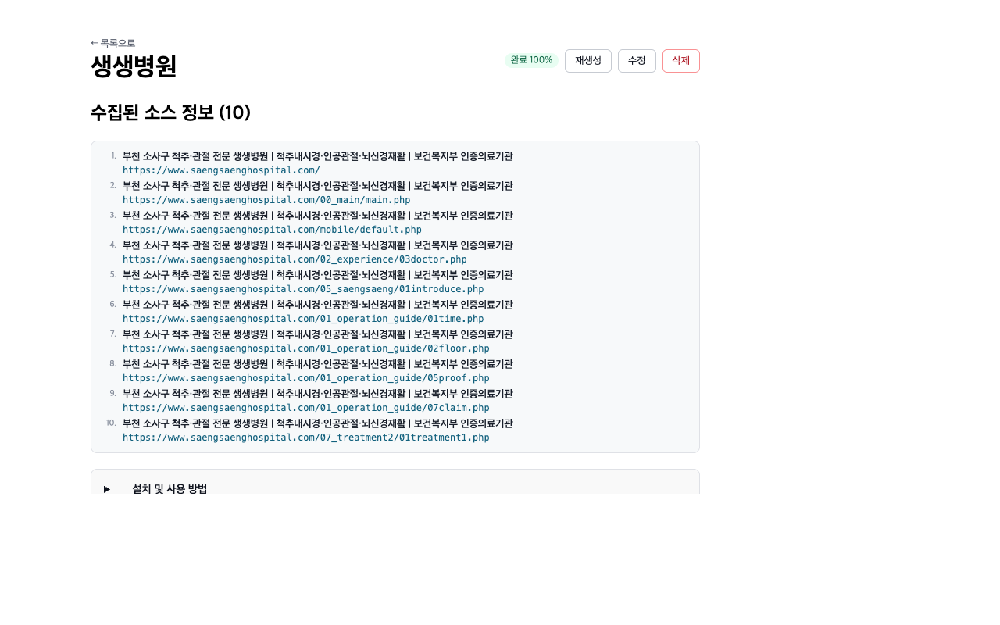</a>

파이프라인 완료 후 사용자가 보는 핵심 화면. 화면 순서대로:
1. **헤더**: 프로젝트명·상태 배지(`완료 100%`), `재생성`·`수정`·`삭제` 액션.
2. **수집된 소스 정보 (10)**: 크롤러가 수집한 실제 URL 10건 목록(제목+원문 링크). 목록을 클릭하면 선택 소스로 Q&A 재생성이 possible.
3. **미리보기 링크** (`👁 미리보기`) — 동일 오리진 iframe으로 실제 위젯을 띄운다.
4. **빠른메뉴 — 자동화된 질문 및 답변**: 도메인 카탈로그(병원 유형) 기반 5개 메뉴(병원정보/의료진/치료방법/연락처/**AI비서란?**)가 각각 접힌 `
`로 표시. `AI비서란?`은 필수 메뉴로 **편집 불가** 고정 답변.
5. **✏️ 빠른메뉴 질문 편집**: 질문을 **1회만** 수정할 수 있는 잠금 정책 UI.
6. **고객센터 Q&A**: 사용자가 질문을 등록 → 관리자 답변 확인 (2000자 제한 카운터).
7. **읽어볼 내용**: 이용약관 / AI 이용고지 / 개인정보처리방침 / 프로그램 사용동의 아코디언 — 한국어 정식 문서.

### `ko-user-03-preview-widget.png` — 위젯 미리보기 (런처 닫힘)
<a href="ko-user-03-preview-widget.png">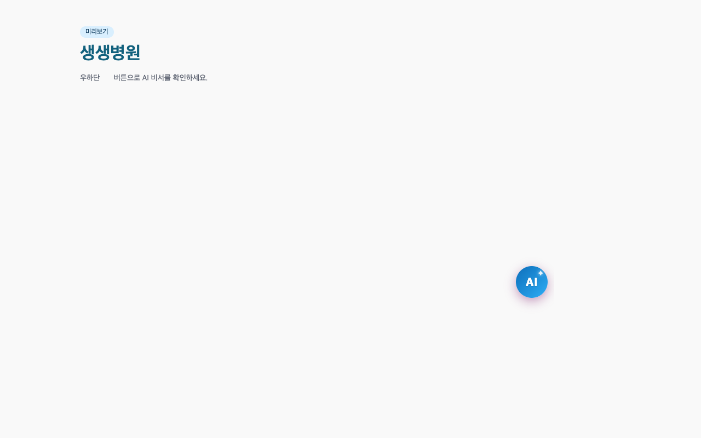</a>
- Django `/preview/3/`가 iframe으로 서빙하는 데모 페이지. `미리보기` 배지와 안내 문구(우하단 💬 버튼)가 한국어.
- 모바일 대응: `viewport-fit=cover` + 하단 safe-area 여백 (스마트폰에서 런처가 가려지던 문제 수정 반영).
- 우하단 **AI 런처 버튼**(✦ 스파크 포함)이 정상 표출.

### `ko-user-04-profile.png` — 내 프로필
<a href="ko-user-04-profile.png">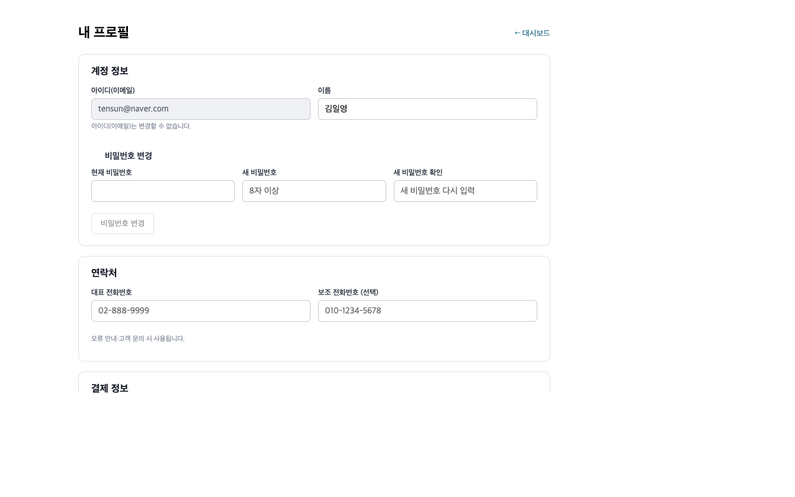</a>

개인 사용자의 계정·연락처·결제 정보 화면:
- **계정 정보**: 아이디(이메일)는 변경 불가(disabled), 이름 수정 가능. 비밀번호 변경(현재/새/확인 3필드, 미입력 시 버튼 disabled).
- **연락처**: 대표·보조 전화번호 2개 — 오류 안내·고객 문의에 사용.
- **결제 정보**: 월 결제 금액 **50,000원** (ko 사일로 기본가, KRW). `💳 결제 수단: PayPal / Stripe — 연동 준비 중` 안내. 회사명/담당자/이메일/주소/비고 입력란.
- 관리자가 이 계정의 `monthly_price`를 지정하면 이 화면의 표시 금액이 바뀐다(기본가 override).

### `ko-user-05-new-project.png` — 새 프로젝트 1단계
<a href="ko-user-05-new-project.png">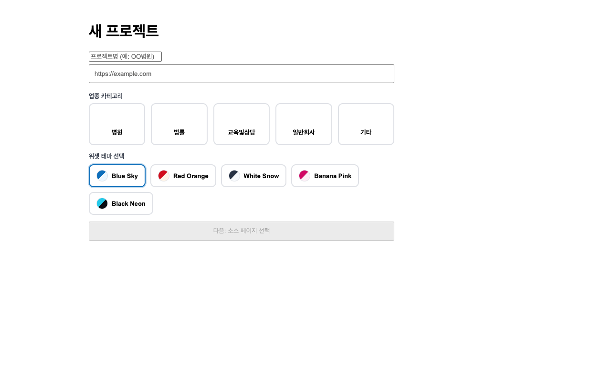</a>

- URL 입력 + **업종 카테고리** 5개(🏥 병원 / ⚖️ 법률 / 🎓 교육및상담 / 🏢 일반회사 / 📦 기타) 선택 카드.
- 카테고리 선택 시 **세부 유형** 드롭다운이 해당 언어 사일로의 카탈로그(한국어 27종 중 해당 카테고리)로 채워진다.
- **위젯 테마 선택**: Blue Sky / Red Orange / White Snow / Banana Pink / Black Neon 5종 (CSS 변수 기반 테마).

### `ko-user-06-dashboard-final.png` — 대시보드 (재방문)
<a href="ko-user-06-dashboard-final.png">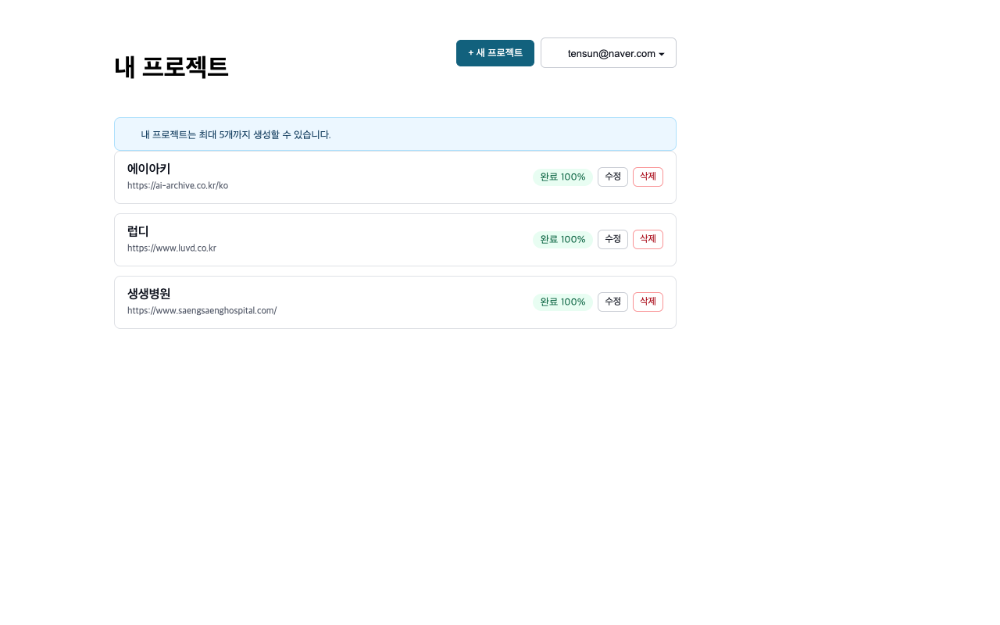</a>

- 세션 유지 상태에서의 대시보드. 프로젝트 상태가 카드별로 `완료 100%` 표시되는 것을 재확인.

## A-3. 관리자 (admin@local)

### `ko-admin-01-dashboard.png` — 관리자 대시보드
<a href="ko-admin-01-dashboard.png">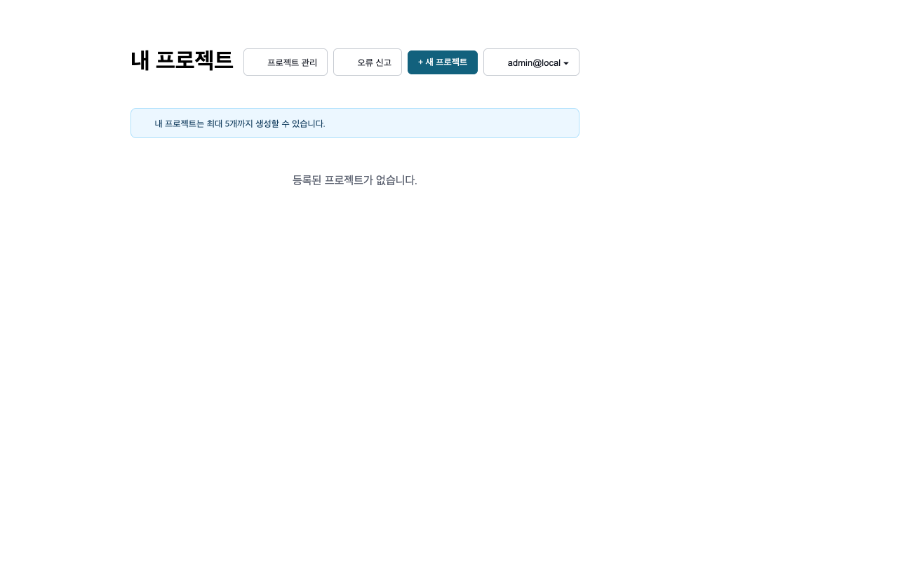</a>
- 개인 사용자와 동일한 레이아웃이지만 **`🛠 프로젝트 관리` / `📮 오류 신고`** 관리자 전용 링크가 추가로 노출.
- admin@local은 소유 프로젝트가 없어 "등록된 프로젝트가 없습니다" 상태 (계정 소유 기준 목록이므로 정상).

### `ko-admin-02-admin-projects.png` — 프로젝트 관리 (진입)
<a href="ko-admin-02-admin-projects.png">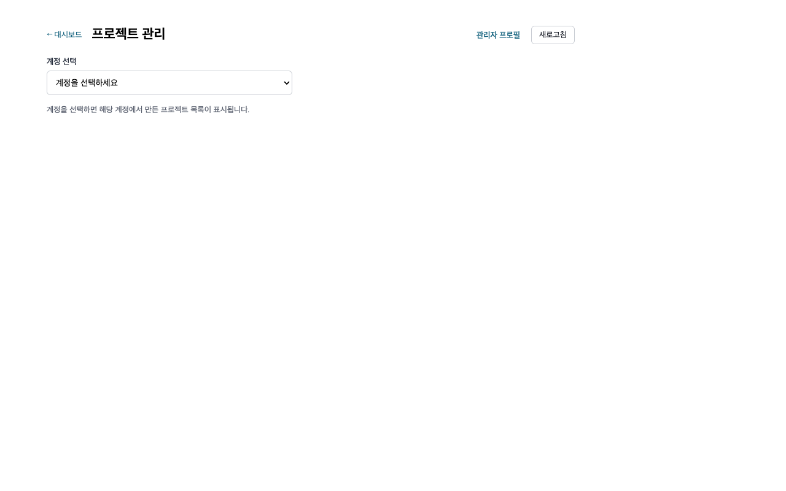</a>
- 전체 사용자 프로젝트를 관리하는 화면. 상단 **계정 선택** 드롭다운:
  - `admin@local (관리자) — 50,000원 (기본)`
  - `tensun@naver.com — 50,000원 (기본)`
- 계정별로 **기본 요금(ko 50,000원)** 이 라벨에 바로 표시된다. 계정을 선택해야 해당 계정의 프로젝트 목록이 로드된다.

### `ko-admin-03-billing-panel.png` — 사용자별 결제/연락처 설정 (계정 선택 후)
<a href="ko-admin-03-billing-panel.png">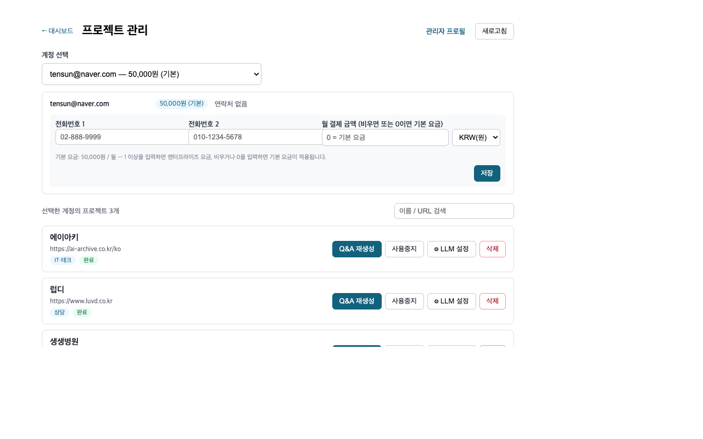</a>

이번 세션의 핵심 기능:
- **tensun@naver.com 선택 시** 즉시 결제 패널이 펼쳐진다.
- 표시 값: **50,000원 (기본)** / 연락처 없음.
- 입력란: `Phone 1` / `Phone 2` (오류 안내 문구용 번호), `Monthly price` 숫자 입력 + **통화 콤보(KRW(원) / USD($))**.
- 안내 문구: 기본가 50,000원/월, **숫자를 1 이상 입력하면 엔터프라이즈 요금**, 빈 값 또는 **0 입력 시 기본 요금으로 복귀** 규칙 설명.
- 하단에 해당 계정의 프로젝트 목록(카테고리·상태 배지) + **Q&A 재생성 / 사용중지 / ⚙ LLM 설정 / 삭제** 액션과 고객센터 Q&A 답변 영역.

### `ko-admin-04-admin-profile.png` — 관리자 프로필
<a href="ko-admin-04-admin-profile.png">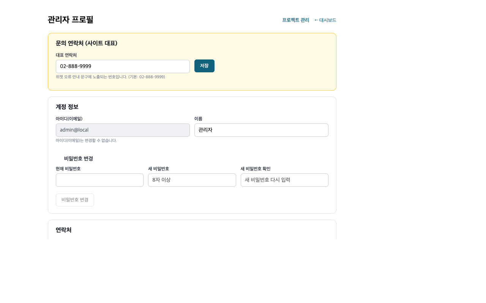</a>
- 개인 프로필에 **`문의 연락처 (사이트 대표)`** 섹션이 추가된 형태. 여기서 수정한 대표 번호(`02-888-9999`)는 **위젯 오류 안내 문구**에 실시간 반영된다(SiteSetting → `/api/site-info/` 공개 API → useSilo `{phone}` 플레이스홀더).
- 그 아래 계정 정보/비밀번호/연락처/결제 정보는 개인 프로필과 동일 구성.

### `ko-admin-05-chat-errors.png` — 오류 신고 관리
<a href="ko-admin-05-chat-errors.png">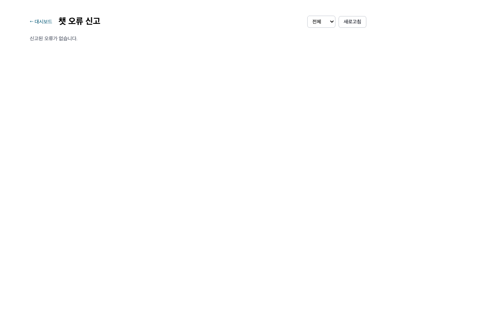</a>
- 위젯 방문자가 `📮 오류 신고하기`로 접수한 ChatErrorReport 목록(상태: 접수/처리 완료 토글).
- 현재 케이스가 없어 빈 상태("신고된 오류가 없습니다").

### `ko-admin-06-django-admin.png` — Django admin
<a href="ko-admin-06-django-admin.png">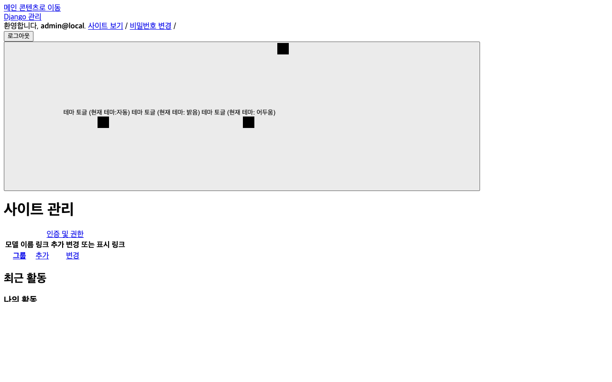</a>
- `/django-admin/` — Django 관리자 화면(인증 및 권한/그룹 등).
- 브라우저 캡처 시점에 `/static/admin/*` 정적 파일이 JSON MIME으로 내려오는 이슈가 관찰됨(스타일 미적용). **콘솔 UI 사용에는 영향 없음** — 필요 시 `collectstatic` 서빙 설정 개선 과제.

---

# Part B — English Silo (en, port 8081) Explanation

> This section explains the **en silo**. Same codebase, but with `NUXT_PUBLIC_SILO_LANG=en`
> injected, all UI is rendered in English. Screens map 1:1 to the ko silo —
> **only the language differs**.

## B-1. Login Screen

### `en-login.png` — English Login Screen
<a href="en-login.png">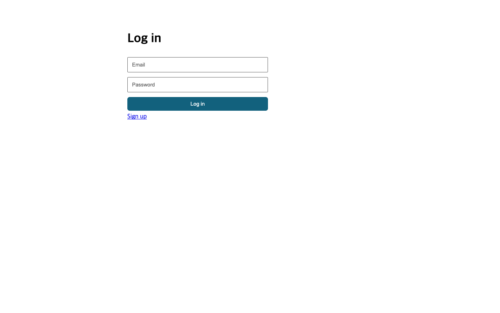</a>

**English login screen.** "Log in" / "Sign up" — same URL path (`/login`) as `ko-login.png` in the ko silo. The UI copy following the silo language on the identical route confirms the useSilo (SSR env) based i18n works.

## B-2. Individual User (tensun@naver.com)

### `en-user-01-dashboard.png` — My Projects (Dashboard)
<a href="en-user-01-dashboard.png">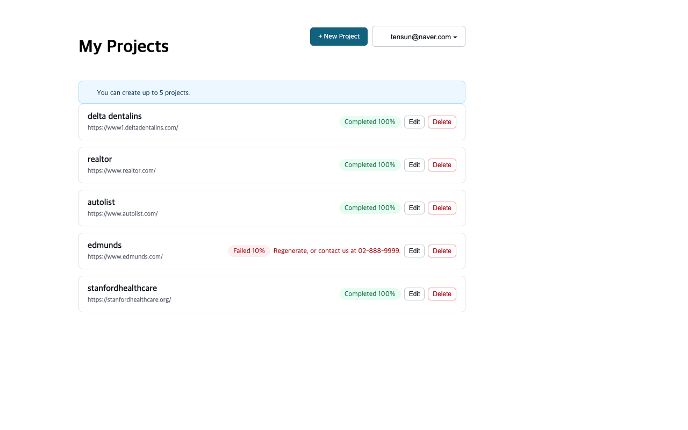</a>
- Heading **My Projects**, hint `📌 You can create up to 5 projects.` — en silo copy rendered in English.
- 5 owned projects: **delta dentalins / realtor / autolist / edmunds / stanfordhealthcare**.
- Status badges render as **`Completed 100%` / `Failed 10%`** rather than Korean — confirming STATUS_LABELS is a useSilo computed that switches with language.
- The failed edmunds card shows `Regenerate, or contact us at 02-888-9999.` — support contact auto-exposed on errors.

### `en-user-02-project-detail.png` — Project Detail (stanfordhealthcare)
<a href="en-user-02-project-detail.png">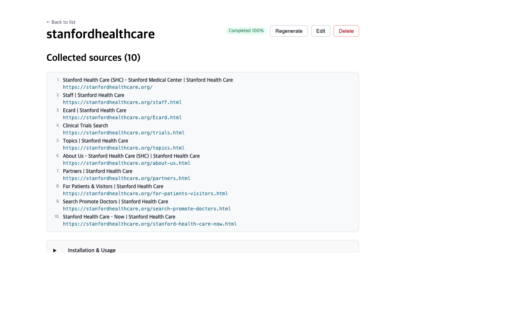</a>
- Same layout as the ko screen but entirely in English: source list **Collected sources (10)**, installation guide as the English component **Installation & Usage** (`InstallGuideEn.vue`), static docs as **Terms & Policies** (`TermsEn.vue` — Terms of Service / AI Disclosure / Privacy Policy / Program Use Agreement).
- Quick menus: About / Doctors / Treatments / Contact / **About AI Assistant** (English label of the required menu).
- Customer Center Q&A copy in English ("Ask a question…", 0/2000 counter).

### `en-user-03-preview-widget.png` — Widget Preview (Launcher Closed)
<a href="en-user-03-preview-widget.png">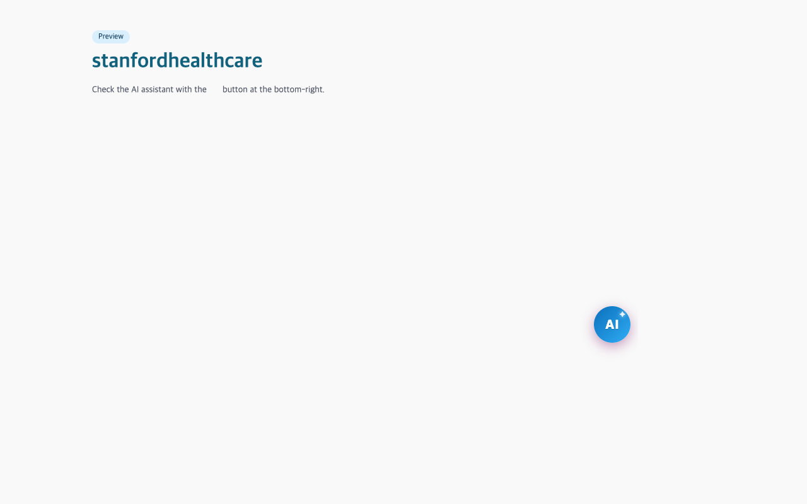</a>
- **Preview** badge and hint `Check the AI assistant with the 💬 button at the bottom-right.` — the en branch of `preview_html()`.
- Same demo layout/launcher position as ko with **only the language differing** → confirms silo isolation with a shared UI structure.

### `en-user-04-profile.png` — My Profile
<a href="en-user-04-profile.png">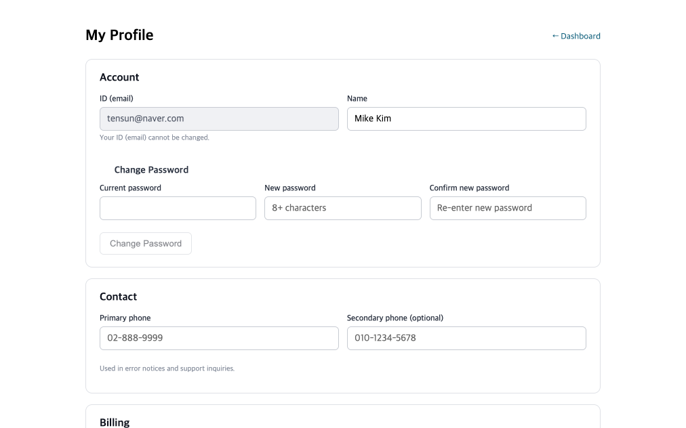</a>
- **Monthly price $49** (en silo default, USD). The same screen shows 50,000 KRW in ko — split by `DEFAULT_MONTHLY_PRICE={'ko':('KRW',50000),'en':('USD',49)}`.
- All labels in English: ID (email) / Name / Change Password / Primary phone / Billing, etc. — useSilo prof.* keys.
- Currency display `$49` is locale-aware (result of the `fmtPrice` locale branch added in this change set).

### `en-user-05-new-project.png` — New Project
<a href="en-user-05-new-project.png">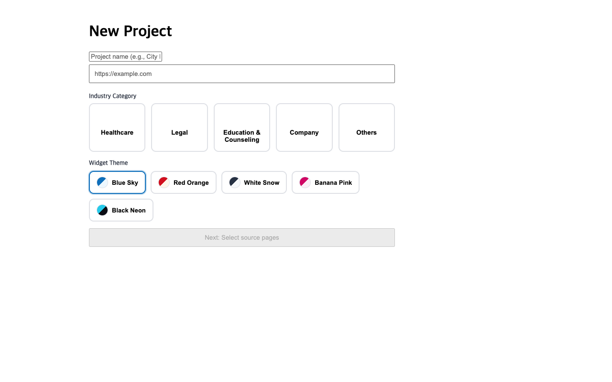</a>
- 5 Industry Categories (**Healthcare / Legal / Education & Counseling / Company / Others**) + 5 Widget Themes — the entry point to the 27-type catalog rendered in English.
- Sub types per industry: selecting Company lists 15 English labels (Chemical, Biotech, Healthcare, Pharma, Electronics, Logistics, Research, Investment, Consulting, Knowledge, Tech, Sales, Construction, Retail, Company).

### `en-user-06-widget-open.png` — Widget Open (English UI)
<a href="en-user-06-widget-open.png">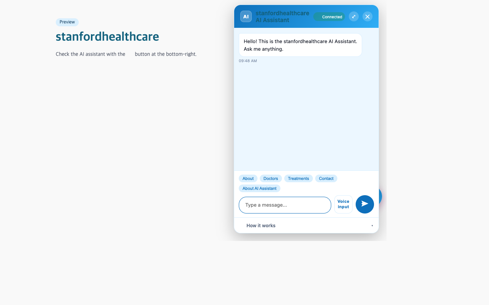</a>
- Clicking the AI launcher in the preview opens the panel.
- Header title **stanfordhealthcare AI Assistant** (en branch of config.title), status badge **✅ Connected**, quick menu pills (About/Doctors/Treatments/Contact/About AI Assistant), input placeholder **Type a message...**, mic label **Voice input**, and `⚙️ How it works` — all served from the widget I18N dictionary (32 keys).
- The clock shows `09:48 AM` — the widget clock also uses the silo locale (`en-US`).

### `en-user-07-widget-answer.png` — Widget Live Chat (English Answer)
<a href="en-user-07-widget-answer.png">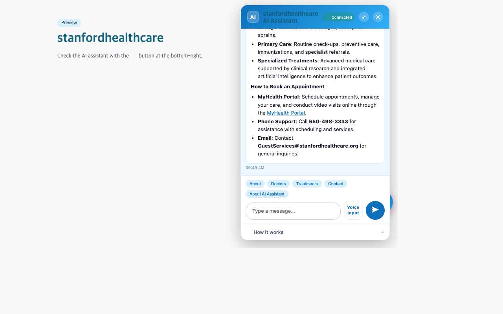</a>
- Sent "What treatments does Stanford Healthcare offer?" directly via the input → received the LLM response.
- The answer is generated as **English markdown** (bold sections + bullets) and cites **only real site data**: Emergency Department 911 / Express Care / Primary Care / Specialized Treatments, plus booking info (MyHealth Portal link, **650-498-3333**, **GuestServices@stanfordhealthcare.org**).
- = the en silo system_prompt + proxy (`/api/chat/`) + server-attached knowledge summary pipeline works end-to-end.

## B-3. Admin (admin@local)

### `en-admin-01-dashboard.png` — Admin Dashboard
<a href="en-admin-01-dashboard.png">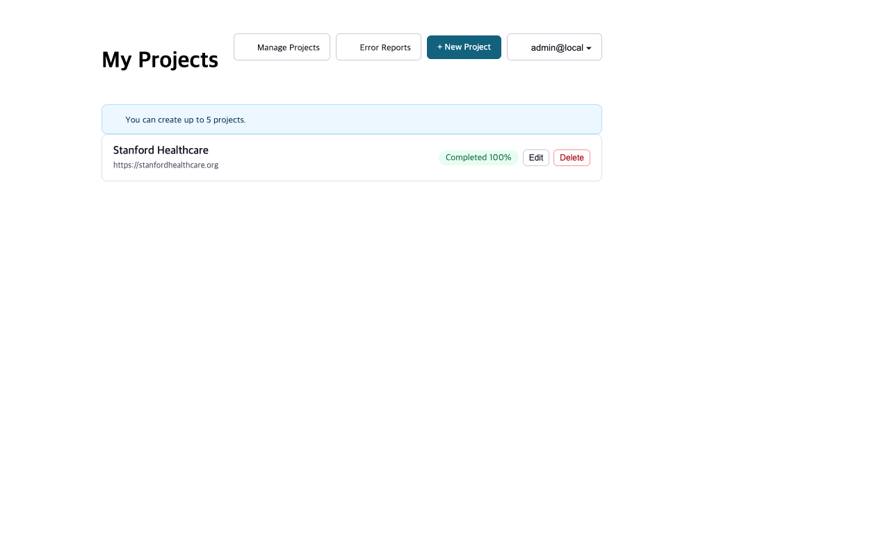</a>
- **🛠 Manage Projects / 📮 Error Reports** links, plus 1 own project (Stanford Healthcare, Completed 100%) — same layout as the user dashboard with admin links added.

### `en-admin-02-admin-projects.png` — Manage Projects (Entry)
<a href="en-admin-02-admin-projects.png">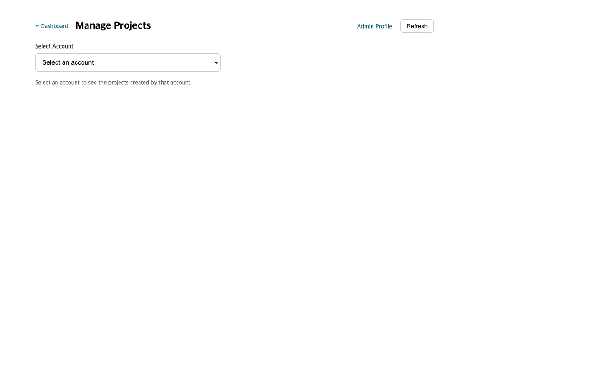</a>
- Account selector dropdown in English: `admin@local (Admin) — $49 (Default)` / `tensun@naver.com — $49 (Default)`.
- Hint `Select an account to see the projects created by that account.` — admin.projects.* keys applied.

### `en-admin-03-billing-panel.png` — Per-user Billing/Contact Settings (en)
<a href="en-admin-03-billing-panel.png">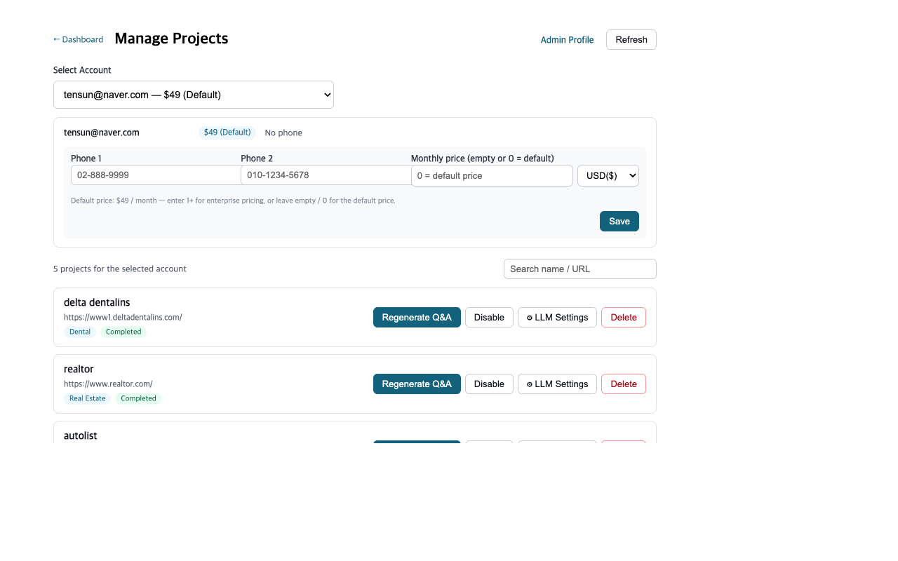</a>
- Selecting tensun@naver.com → the English version of the billing panel:
  - **$49 (Default)**, Phone 1/Phone 2, Monthly price input + currency combo (**KRW(원) / USD($)** — the option labels keep Korean for universal recognition).
  - Copy: `Default price: $49 / month — enter 1+ for enterprise pricing, or leave empty / 0 for the default price.` — even the "0 resets to default" rule is explained in English.
- The project list below shows 5 rows (Delta Dentalins=**Dental**/Completed, realtor=**Real Estate**, autolist=**Retail**, edmunds=Retail/**Failed**, stanfordhealthcare=**Hospital**) — domain badges newly added to en by the 27-type catalog symmetric seeding are visible as-is.
- **Customer Center Q&A (0)** — the admin answer area is also fully in English.

### `en-admin-04-admin-profile.png` — Admin Profile
<a href="en-admin-04-admin-profile.png">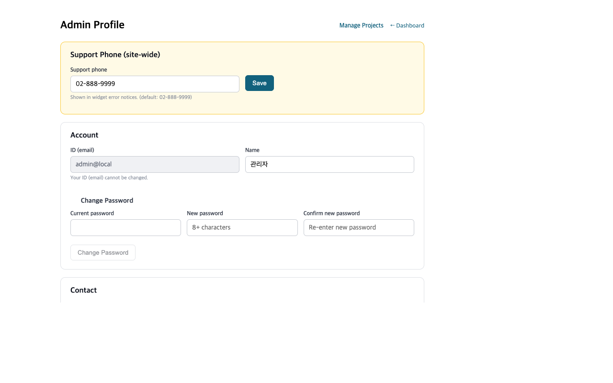</a>
- The **Support contact** section (site-wide) plus account/password/contact/Billing editing — the 1:1 English counterpart of the ko admin profile.

### `en-admin-05-chat-errors.png` — Error Reports
<a href="en-admin-05-chat-errors.png">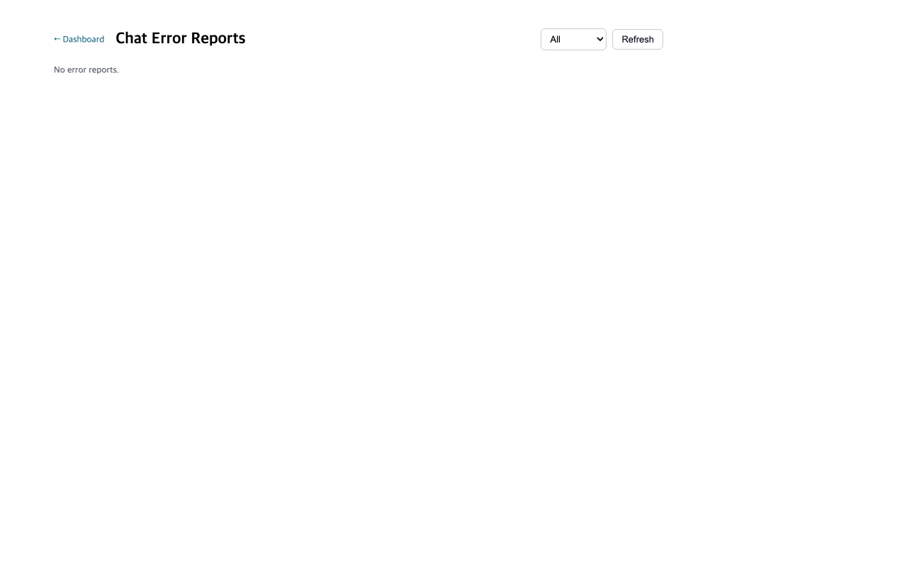</a>
- Error report management screen — empty-state copy in English (`admin.errors.empty` = "No error reports."). Project/Question/Detail column labels included.

### `en-admin-06-manual.png` — Integration Manual (`/manual`)
<a href="en-admin-06-manual.png">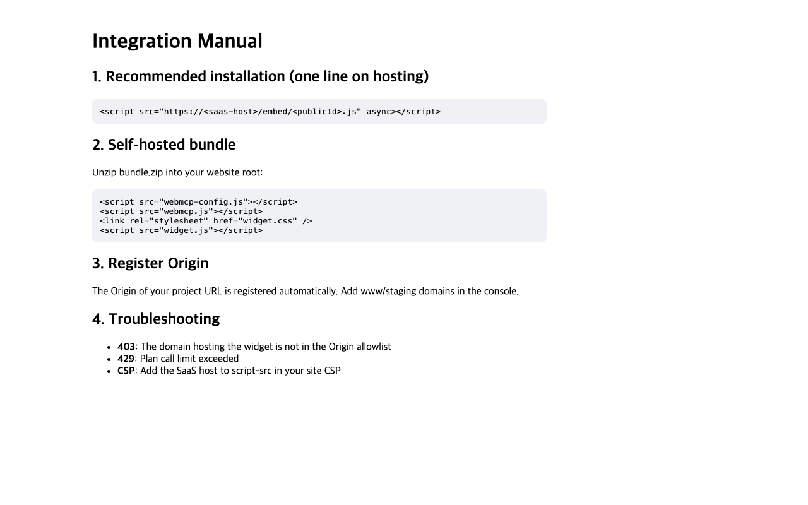</a>
- **English-only manual page**: 1) Recommended installation (one-line script) 2) Self-hosted bundle (bundle.zip contents/code) 3) Register Origin 4) Troubleshooting (403/429/CSP explanations).
- `/manual` used to be hardcoded in Korean; it now follows the silo language via the 10 useSilo `manual.*` keys — a direct result (and representative case) of this i18n improvement.

---

## 테스트에서 확인된 핵심 동작 요약

1. **언어 격리 완성** — 같은 코드베이스를 2개 컨테이너로 띄우고 `WEBMCP_LANG`/`NUXT_PUBLIC_SILO_LANG`만 달리 했을 때, 로그인→대시보드→프로젝트→위젯→프로필→관리 전 구간 UI가 완전히 해당 언어로 동작한다.
2. **요금 체계 사일로 분리** — ko 50,000원/KRW vs en $49/USD, 관리자가 특정 계정의 금액(엔터프라이즈)을 지정하면 개인 프로필에도 그 값이 반영된다.
3. **en 위젯 LLM 응답 품질** — 실제 크롤링 지식 기반의 영어 마크다운 답변 + 실제 연락처/링크 인용(지어내기 금지 프롬프트 정상 동작).
4. **역할 분리** — 사용자는 자기 프로젝트/프로필만, 관리자는 전체 사용자의 결제·연락처·프로젝트·Q&A·오류 신고를 관리.
5. **모바일 대응** — 미리보기 페이지 safe-area/하단 여백이 적용되어 런처가 콘텐츠와 겹치지 않는다.

## 관측된 사소한 이슈 (기능 영향 없음)

- `ko-admin-06-django-admin.png`: Django admin 정적 파일(`static/admin/*`)이 `application/json` MIME으로 응답되어 스타일이 깨져 보임 — 향후 nginx/collectstatic 서빙 점검 과제.
- 세션 CSRF 만료 후 재로그인이 한 번 실패했다가 성공(정상 동작 — 페이지 새로고침으로 CSRF 쿠키 재발급).